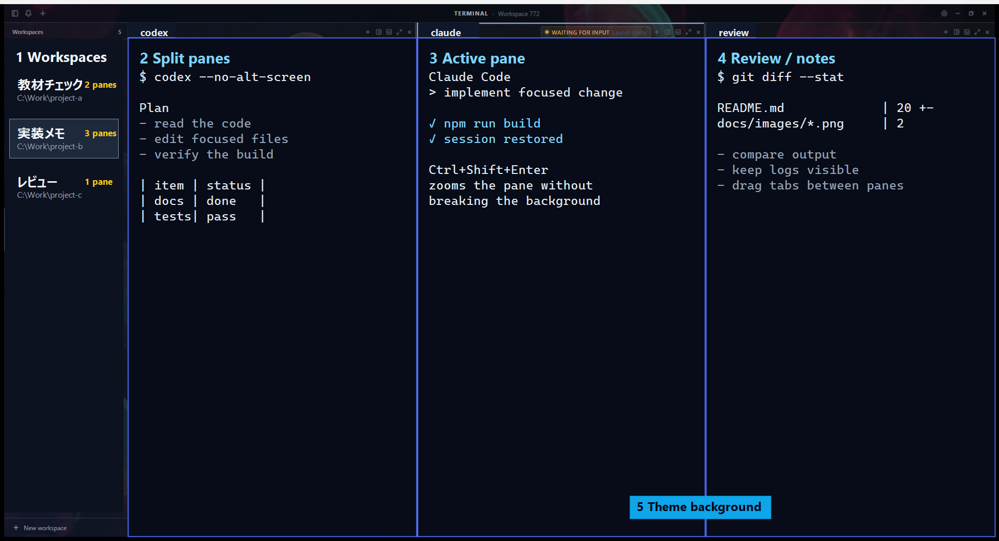

# mycmux

mycmux は、Claude Code / Codex / claude-codex / Grok Build といった AI エージェント CLI を、ワークスペース・ペイン・タブの単位で並べて動かすターミナルワークスペースです。Windows を主戦場に、エージェントが出したパスをワンクリックで開く、作業の区切りを保存して人へ渡す、複数アカウントの使用量をタイトルバーで見張る、エージェント自身が可視タブで別のエージェントを起動する、といった実務向けの機能を足しています。[cmux-for-linux (ptrcode)](https://github.com/cai0baa/cmux-for-linux) のフォークで、ライセンスは GPL-3.0 です。配布物は公開ミラーの固定 feed リリース ([mycmux-personal-updater](https://github.com/miyafcos/mycmux-team/releases/tag/mycmux-personal-updater)) から取得します。現行版は v0.60.1 (2026-08-30) です。

読み方は 2 通りに分かれます。**1〜3 章は初回に通読**してください (何ができるか / 入れ方 / 最初の 10 分)。**4 章以降は必要になったときに引く**参照部で、章の中は「〜したい → こうする」の逆引きと表で並べてあります。付録 A〜H はキー・コマンド・設定項目・保存先の全一覧です。

このリポジトリの 168 日ぶんの歩みと、全 230 リリースの年表は **[docs/history/index.html](docs/history/index.html)** にまとめてあります (ブラウザで開いてください。ライトとダークの切り替えつき)。



スクリーンショット内の端末本文と作業名は、公開用のサンプル表示に差し替えています。

## 目次

通読部: [1. 30 秒でわかる mycmux](#1-30-秒でわかる-mycmux) / [2. インストールと更新](#2-インストールと更新) / [3. 最初の 10 分](#3-最初の-10-分)

参照部: [4. ワークスペース・ペイン・タブ](#4-ワークスペースペインタブ) / [5. ターミナル](#5-ターミナル) / [6. エージェントを起動する](#6-エージェントを起動する) / [7. エージェントに委譲する](#7-エージェントに委譲する) / [8. セッションを残す・戻す](#8-セッションを残す戻す) / [9. ダッシュボード](#9-ダッシュボード) / [10. 成果物を見る・直す](#10-成果物を見る直す) / [11. アカウントと使用量](#11-アカウントと使用量) / [12. AI ログ分析 (ailog)](#12-ai-ログ分析-ailog) / [13. 通知と状態検知](#13-通知と状態検知) / [14. 見た目と設定](#14-見た目と設定) / [15. リモート・Buddy・ペット](#15-リモートbuddyペット)

状態別: [16. 開発中の機能](#16-開発中の機能) / [17. 計画中の機能](#17-計画中の機能) / [18. 廃止した機能](#18-廃止した機能)

困ったとき・開発: [19. 困ったとき](#19-困ったとき) / [20. 開発者向け](#20-開発者向け)

歩み: [21. これまでの 168 日](#21-これまでの-168-日)

付録: [A 既定キーバインド](#付録-a-既定キーバインド全一覧) / [B ランチャー項目](#付録-b-ランチャー項目全一覧) / [C CLI サブコマンド](#付録-c-cli-サブコマンド全一覧) / [D ソケットコマンド](#付録-d-ソケットコマンド全一覧) / [E 設定タブと項目](#付録-e-設定タブと項目) / [F 環境変数 MYCMUX_](#付録-f-環境変数-mycmux_) / [G 保存先とファイル](#付録-g-保存先とファイル) / [H 用語集](#付録-h-用語集)

---

## 1. 30 秒でわかる mycmux

### 画面の見方

| 番号 | 場所 | できること |
| --- | --- | --- |
| 1 | Workspaces (サイドバー) | 案件、調査、実装などの単位で作業場所を切り替える。行にはキャラ、承認待ちバッジ、タブ数、タブ名が出る |
| 2 | Split panes | Codex、Claude Code、ログ確認などを横に並べて見る。1 ペインの中はさらにタブで分かれる |
| 3 | Active pane | 今操作しているペインを見分け、`Ctrl+Shift+Enter` で拡大する |
| 4 | Review / notes | 差分、メモ、別エージェントの出力、成果物プレビューを同時に確認する |
| 5 | Theme background | テーマ 30 本と壁紙 59 枚を切り替えて、長時間作業しやすくする |

タイトルバーは左からサイドバー開閉・通知ベル・セーブポイント・新規ワークスペース、中央にワークスペース名、右に使用量メーター・AI ログ分析・ダッシュボード・設定が並びます。ボタンの全一覧は [4 章](#タイトルバーのボタン)にあります。

### 何ができるか

- 複数の Claude Code / Codex / claude-codex / Grok Build セッションを 1 画面に並べ、ワークスペース単位で切り替える
- ターミナル出力中のファイルパスをリンク化する。クリックで開き、エクスプローラーでの場所表示にも飛べる (日本語・空白入りパス対応)
- md / html / Office 文書はアプリ内でプレビューし、html と docx 系はその場で編集して元ファイルへ保存する
- ペインの中のエージェントに「続きは Codex で」と頼むと、エージェント自身が引き継ぎ書つきの可視タブを開いて相手を起動する
- ダッシュボード (`Ctrl+Shift+G`) で全ワークスペースを俯瞰し、会話を最大 5 列並べ、`@` で宛先を指定してまとめて指示を送る
- Claude の質問 (AskUserQuestion) を別タブへ行かずにカードで読み、選択肢ボタンで答える
- 作業の区切りを「セーブポイント」として残し、必要な 1 件だけを `.mycmux-transfer` ファイルで人へ渡す
- 複数の Claude / Codex / Grok アカウントの使用量を常時監視し、枠が切れたら CLI のログインごと切り替える
- ローカルのエージェントログを索引して、何にいくら使ったかを AI ログ分析パネルで見る
- 誤って閉じたタブは `Ctrl+Shift+T` で会話ごと復活し、アプリを再起動しても前回のペイン構成と会話へ戻る

---

## 2. インストールと更新

### Windows — 固定 feed のインストーラを取る

最新のインストーラは公開ミラーの固定 feed リリース <https://github.com/miyafcos/mycmux-team/releases/tag/mycmux-personal-updater> にあります。このリリースには過去バージョンの資産も並んでいるので、**バージョン番号が最新の** `mycmux_<version>_x64-setup.exe` をダウンロードして実行してください (最新バージョンは同リリースの `latest.json` の `version` フィールドで確認できます)。

```powershell
# latest.json から最新バージョンを引いて、そのインストーラだけ落とす
$feed = "https://github.com/miyafcos/mycmux-team/releases/download/mycmux-personal-updater/latest.json"
$version = (Invoke-RestMethod $feed).version
gh release download mycmux-personal-updater --repo miyafcos/mycmux-team --pattern "mycmux_${version}_x64-setup.exe"
```

SmartScreen が出る場合は「詳細情報」から実行してください。現在の配布物は Authenticode 署名なしです。

### 更新は「設定 → アプリ情報 → 更新を確認」

設定 (⚙) →「アプリ情報」→ ボタン「更新を確認」で、署名検証・ダウンロード・自動再起動まで進みます (Tauri updater)。起動直後に強制的に更新をかけるループは v0.8.45 で撤去済みで、更新は明示操作だけです。mycmux をもう 1 つ起動しようとしても 2 つ目のインスタンスは立ち上がらず (v0.8.20 の二重起動防止)、`data.json` の読み書きはプロセス間ロックで直列化されています。並行して動かしたいときは次の `--profile` を使います。状態: 配信済み v0.3.0 / feed の署名 key-id 検証を工程に組み込み v0.21.30。

> **0.21.2 以前をインストールしている端末**は旧公開鍵しか持っていないため、自動更新では新しい版を受け取れません。固定 feed から 0.21.3 以降のインストーラを 1 回だけ手動で当ててください。

### 本番と分けて試したい → `--profile`

`mycmux.exe --profile <name>` で起動すると、設定・ソケット・ailog の DB・シングルインスタンス枠まで本番と分離したテスト用インスタンスが並行で立ちます。タイトルバーに赤い「TEST (プロファイル名)」バッジが出て、updater は無効、使用量ポーリングも止まります。プロファイル名は英数と `-` `_` のみ、1〜64 文字です。`scripts/test-profile.ps1` は同じことをスクリプトから行います。状態: 配信済み v0.31.1 / 本番データへ届く経路の遮断を追加 v0.38.0。

### Resume パレットを使いたい → `crsm` を別途ビルド

過去セッション一覧 (`Ctrl+P`) は外部ツール `crsm` に依存していて、アプリには同梱していません。mycmux は `PATH` 上の `crsm` → `~/bin/crsm.exe` → `~/crsm/target/release/crsm.exe` の順に探します。

```powershell
git clone https://github.com/miyafcos/crsm.git $env:USERPROFILE\crsm
cd $env:USERPROFILE\crsm
cargo build --release
```

ソースから mycmux を起動する場合:

```powershell
git clone https://github.com/miyafcos/mycmux-team.git
cd mycmux-team
npm install
npm run tauri dev
```

### macOS (ソースビルド)

macOS 向けの公式 release バイナリは現状ありません。ソースから `.app` を作って `/Applications` に置く運用で、Apple Silicon (arm64) を想定しています。前提は Xcode Command Line Tools (`xcode-select --install`)、Rust (rustup)、Node.js / npm です。

```bash
git clone https://github.com/miyafcos/mycmux.git ~/dev/mycmux
cd ~/dev/mycmux
npm install
npm run tauri build
mv "/Applications/mycmux.app" ~/.Trash/ 2>/dev/null   # 既存があれば
cp -R src-tauri/target/release/bundle/macos/mycmux.app /Applications/
xattr -cr /Applications/mycmux.app                    # Gatekeeper の quarantine 属性を除去
open /Applications/mycmux.app
```

Resume palette (`Cmd+P`) を使うには `crsm` を `git clone https://github.com/miyafcos/crsm.git ~/crsm` → `cd ~/crsm` → `cargo build --release` で先に用意します (以後 `~/crsm/target/release/crsm` を自動検出します)。

> **macOS のキー表記**: 本文は `Ctrl+…` で書いています。macOS では `Cmd+P` のように `Cmd` だけを修飾に使うショートカットが `Ctrl` 相当として動きます。`Cmd+Shift+N` のような `Cmd+Shift` の組み合わせは現行の橋渡しでは効かないので、`Ctrl+Shift+N` をそのまま使ってください。タイトルバー右端の最小化・最大化・閉じるはネイティブのトラフィックライトに置き換わります。

### 旧 lite 版 (mycmux-lite) を入れている場合

lite 版の配布は 2026-07-23 に終了しました。以降の更新はこの通常版だけに配信されます。署名鍵とアプリ識別子が別なので自動更新では乗り換えられません。固定 feed リリースから `mycmux_*_x64-setup.exe` をダウンロードして通常版をインストールし、旧 `mycmux-lite` はアンインストールしてください。ワークスペース設定は引き継がれないため、新規セットアップになります。

---

## 3. 最初の 10 分

順番に 6 つだけやると、mycmux の骨格がひととおり通ります。

**1. ワークスペースを作る** — `Ctrl+Shift+N` を押し、名前とレイアウトを決めて「Launch」。ワークスペースは案件や調査の単位です。ここで分けておくと、あとで `Ctrl+Tab` と `Ctrl+1`〜`Ctrl+8` の行き来が効きます。何も無い状態なら「ホームで新規ワークスペース」「フォルダを選んで開始」「詳しく設定して作成」の 3 ボタンが出るので、真ん中を押して作業フォルダを選ぶのが早いです。

**2. ランチャーで Claude Code を立てる** — 新しいペインを開くと起動メニューが出ます。`1` を押すと `Claude Code` が起動します。先に作業ディレクトリを変えたいときは `d` (開発) か `a` (案件) を押してから選びます。ディレクトリを変えてから起動すると、そのリポジトリの CLAUDE.md とプロジェクト履歴を持つセッションになります。

**3. 分割してもう 1 本立てる** — `Ctrl+Alt+D` で右に分割し、そこで `2` を押して `Codex` を起動します。分割は「並べて見比べる」ためのもので、1 つのペインの中で切り替えたいだけならタブバーの「＋」でタブを足すほうが場所を食いません。

**4. パスリンクで成果物を開く** — エージェントが出力したファイルパスをクリックします。md / html / Office ならその場でプレビュータブが開き、それ以外はクリック位置に「既定のアプリで開く」「エクスプローラーで表示」の 2 アイコンが出ます。パスは実在チェックを通ったものだけがリンクになるので、存在しない文字列を押して空振りすることはありません。

**5. セーブポイントを残す** — 区切りがついたらペインタブバーの「しおり」ボタンを押します。サマリ 1 行 (空欄なら自動生成) を確認して保存すると、会話履歴の要約・引き継ぎ書・復元情報が 1 件のセーブポイントになります。同じセッションで押し直せば上書き更新、「終了時の記録を残す」を選べばあとから変わらない記録になります。中断のたびにこれを押しておくと、翌日は要点から再開できます。

**6. 更新を確認する** — 設定 (⚙) →「アプリ情報」→「更新を確認」。ここまでで、作る・立てる・並べる・開く・残す・更新するがひととおり回ります。

次に読むなら、エージェント同士の受け渡しをしたい人は [7 章](#7-エージェントに委譲する)、複数セッションを 1 画面でさばきたい人は [9 章](#9-ダッシュボード)へ。

---

## 4. ワークスペース・ペイン・タブ

用語は 3 段です。**ワークスペース**が案件などの作業場、その中に**ペイン**がグリッドで並び、1 ペインの中に**タブ**が積まれます (用語集は[付録 H](#付録-h-用語集))。

### タイトルバーのボタン

左から右の順。状態はすべて配信済みで、macOS では最後の 3 件がネイティブのトラフィックライトに置き換わります。

| 表示 / tooltip | できること |
| --- | --- |
| `TEST (プロファイル名)` | テストプロファイル起動中の赤バッジ (ボタンではありません) |
| `Toggle Sidebar (Ctrl+B)` | サイドバーの開閉 |
| `Notifications` | 通知パネルの開閉。未読があるとドットが付く |
| `セーブポイントを開く` | セーブポイント一覧を開く (しおりアイコン) |
| `New Workspace (Ctrl+Shift+N)` | ワークスペース作成モーダルを開く |
| `TERMINAL` | ウィンドウのドラッグ領域。300ms 以内の 2 クリックで最大化・復元 |
| ワークスペース色ドット | アクティブなワークスペースの色 (tooltip は色名) |
| ワークスペース名 | アクティブなワークスペース名 |
| `アカウントと使用量` | 使用量メーターの常時表示 + アカウントパネルの開閉 |
| `AIログ分析` | AI ログ分析パネルの開閉 |
| `ダッシュボード` | ダッシュボードの開閉 (`Ctrl+Shift+G`) |
| `Settings` | 設定ダイアログを開く (歯車) |
| `Minimize` | ウィンドウの最小化 |
| `Maximize` | 最大化と復元のトグル (最大化中は `Restore`) |
| `Close` | ウィンドウを閉じる。実行中のエージェントが 1 件以上あれば件数付きの終了確認が出る |

### 案件ごとに端末をまとめたい → ワークスペースを分ける

`Ctrl+Shift+N` で作成し、`Ctrl+Tab` / `Ctrl+Shift+Tab` で前後へ、`Ctrl+1` `Ctrl+2` `Ctrl+3` `Ctrl+4` `Ctrl+5` `Ctrl+6` `Ctrl+7` `Ctrl+8` で番号ジャンプ、`Ctrl+9` で最後のワークスペースへ移動します。閉じるのは `Ctrl+Shift+W` で、中に生きているペインがあれば確認ダイアログが出ます。作成時のレイアウトは `1x1` `2x1` `3x1` `4x1` `2x2` `3x2` `1x2` `2x3` の 8 種から選べます (既定は `3x1`)。行の並べ替えはドラッグ、色分けは行ホバーで出る「⋮」→「色」から 8 色 +「なし」、名前変更はダブルクリックか「⋮」→「名前を変更」です。切り替えて戻ったときのフォーカスは、ワークスペースごとに最後にいたペインへ復元されます。

状態: ワークスペース本体 配信済み v0.1.0 / 色分け v0.21.31 (⋮ 化 v0.21.34) / フォーカス記憶 v0.9.0 / ようこそ画面 v0.21.30 / サイドバー幅のドラッグ変更 v0.50.0 (200〜560px・既定 280px)。

### 並べて見比べたい → ペインを分割する

`Ctrl+Alt+D` で右、`Ctrl+Alt+Shift+D` で下に分割します。フォーカスは `Ctrl+Alt+ArrowLeft` `Ctrl+Alt+ArrowRight` `Ctrl+Alt+ArrowUp` `Ctrl+Alt+ArrowDown` (`Ctrl+Alt+←` `Ctrl+Alt+→` `Ctrl+Alt+↑` `Ctrl+Alt+↓`) で移し、`Ctrl+Alt+W` で閉じます。ペインの境界はドラッグで比率を変えられ、比率はワークスペースに保存されます。1 つに集中したいときは `Ctrl+Shift+Enter` で拡大・復元します。ペインを閉じる前には、裏で動いているエージェントタブを列挙した確認ダイアログが出ます。確認中に増えたタブも再チェックするので、長時間の委譲を巻き添えで殺しにくくなっています。最後の 1 ペインは閉じられません。

状態: 分割 配信済み v0.1.0 / 「下に分割」ボタンの表示切替 v0.9.2・「右に分割」ボタンの表示切替 v0.9.5 (どちらも設定「通知とレイアウト」) / 巻き添え確認 v0.36.0。

### ペイン内タブ — 1 つのペインに端末を積んで切り替える

タブバーの「＋」(`New terminal tab`) で追加し、`Ctrl+Alt+PageDown` / `Ctrl+Alt+PageUp` で巡回します。非アクティブのタブも PTY は動き続け、選んだときにスクロールバックを復元します。名前はダブルクリックで編集、空にすると自動命名へ戻ります。`Ctrl+Alt+P` でアクティブタブをピン留めするとタブ帯の先頭に固定されます。閉じるのはタブピルの「×」か中クリックです。

| したいこと | 入口 | 状態 |
| --- | --- | --- |
| 全タブを 1 リストで見る | タブバーの「⋯」(`All tabs`)。狭いときは `1/3 ▾` 表記 | 配信済み v0.13.2 / 表示崩れの修正 v0.20.0 |
| 要対応のタブへ順に飛ぶ | `Ctrl+Alt+A` | 配信済み (初出版不明) |
| 閉じたタブ・ペインを会話ごと戻す | `Ctrl+Shift+T` | 配信済み v0.11.0 / タブの × も対象 v0.21.31 |
| 同じ会話から枝分かれさせる | タブピルの「セッションを複製」ボタン | 配信済み v0.37.0 相当 |
| ダッシュボードで開く | ケバブメニュー「Open in dashboard」 | 配信済み (初出版不明) |
| ペイン幅に応じてタブバーを畳む | 自動。`full → slim → compact → compact3 → compact2 → compact1 → micro` の 7 段階 | 配信済み (v0.15.0 の 2 段 → v0.19.0 で畳む順を再設計 → v0.36.0 でチップ化) |
| 溢れた操作をまとめて出す | 「⋮」(`Pane actions`) | 配信済み v0.16.0 |
| 非アクティブタブの名前を確かめる | 26px チップに 120ms ホバー | 配信済み v0.36.0 |

### 散らばったタブを組み替えたい → ドラッグ＆ドロップ

タブピルまたはタブバーの余白を掴むと、カーソル追従のゴーストとドロップ先のプレビュー枠が出ます。落とせる先は「このタブのペインに追加」「タブを統合」「左にタブ」「右にタブ」「上にタブ」「下にタブ」「新しいワークスペースへ移動」です。相手のペインに生きたエージェントがいるときは、移動ではなく「◯◯ へ引き継ぎ文書を渡す」チップが出ます ([8 章](#8-セッションを残す戻す)参照)。状態: 配信済み (ラベル日本語化 v0.17.0 / 自ペインへの無意味なチップを非表示 v0.19.0)。

### 別ウィンドウへの切り出し (tear-out) — セッションは動いたまま移る

サイドバーのワークスペース行を「⋮」→「新しいウィンドウで開く」、またはウィンドウの外までドラッグすると、セッションを起動し直さずに別の OS ウィンドウへ移せます。バナー「⬈ 離すと新しいウィンドウで開きます」が目印です。そのウィンドウを閉じると中身はメインウィンドウへ戻ります。状態: 配信済み v0.21.33 / ドラッグ切り離しと ⋮ メニュー化 v0.21.34。**ウィンドウの配置と割り当ては再起動時に保持されません** (永続化は [17 章](#17-計画中の機能)の計画)。

---

## 5. ターミナル

各ペインは xterm.js の端末です。スクロールバックは 5000 行、`TERM=xterm-256color` / `COLORTERM=truecolor` / `TERM_PROGRAM=ptrterminal` を子プロセスへ渡します。プロセスが終了すると `[Process exited]` を黄色で表示し「↺ Restart」ボタンを出します。

### エージェントが出したパスを開きたい → パスリンク

出力中のファイル・フォルダパスは、実際にディスク上に存在する最長プレフィックスまでがリンクになります。対応するのは `file:///…`・`C:\…`・`/c/Users/…` (MSYS)・`~/…`・`./…`・`../…`・カレント相対・拡張子付きの単体ファイル名です。折り返した行 (ソフトラップ / ハードラップ最大 4 行) をまたぐパスも結合して認識し、スペース入りのフォルダ名も解決します。画面に映っている行の前後 8 行ぶんは先に解決してあるので、ホバーした瞬間にリンクが出ます。

クリックすると 3 通りに分かれます。プレビューできる拡張子ならアプリ内プレビュー、末尾がパス区切りのディレクトリならエクスプローラー表示、それ以外は「既定のアプリで開く」「エクスプローラーで表示」の 2 アイコンポップアップです。開けなかったときはペイン上部に「開けませんでした」などの日本語エラー帯が出ます。

状態: 配信済み v0.9.3 (任意拡張子) / フォルダと実在チェック v0.9.4 / 相対パス・`~/` と折り返し対応 v0.20.0 / 日本語・空白入りパスの折り返し v0.21.14 / 正しいフォルダを開く修正 v0.50.0。

### 送った命令の位置に戻りたい → ターンチップとターン一覧

スクロールバックを遡ると画面上にチップが出て、自分が送ったコマンドやプロンプトの位置を「▲」「▼」で前後に移動できます。メタ表示は「ターン 3/12」形式で、エージェントペインではダッシュボードのトランスクリプトを歩く transcript モードになり「会話履歴」と出ます。ラベルボタンを押すと、そのセッションで送った命令の一覧 (最大 200 行・新しい順) が開き、行クリックでその位置へスクロールします。スクロールバックから消えた行はトランスクリプト側から補完し、「ダッシュボードで開く」で読めます。チップは底から離れて 100ms で出て、底に戻って 900ms で消えます (ホイール上やホバー中は 2500ms 保持)。

状態: 配信済み v0.46.1 (チップ) / 矢印をボタン化 v0.47.1 / 1 文字の返答もターンに数える v0.48.0 / 再起動をまたぐ永続化 v0.49.0 / 復元ペインのターン復旧 v0.52.0 / 一覧を開く v0.53.0 / 遡っている間だけ表示 v0.54.0 / TUI ペインの会話を歩く v0.55.0。

### スクロールバックは再起動をまたいで残る

PTY の生スクロールバックはディスクへ保存されます (`%APPDATA%/com.miyazaki.mycmux/scrollback/<id>.bin`・1 セッション 256 KB 前後・10 秒間隔で flush)。セッションが死んでいて永続スクロールバックがあるときはそれを再生し、生きているときはバックエンドのリングから取り直します。ペインが非表示だった間に落ちた出力も再生され、再構成できないときは PTY を 1 行だけリサイズしてエージェント TUI に再描画させます。状態: 配信済み v0.49.0 (書き込み・再生・ターンマーク永続化の 3 便)。

### 長い指示を打ち直したい → ペインの専用入力欄

ターミナルの下に textarea が付き、選択・カーソル移動・undo が普通のエディタ同様に効きます。`Enter` で送信、`Shift+Enter` で改行、IME 変換確定の `Enter` は送信になりません。`Ctrl+Alt+I` でフォーカスします。送り方は相手に合わせて自動調整されます (Claude Code は貼り付け / Codex は行単位 / 素のシェルは改行をスペースに畳む)。左の送信先バッジには `Claude` / `claude-codex` / `Codex` / `Grok` /「シェル」が出ます。上限は 10 万文字です。シェルペインでは、ターミナル側に打ちかけていた行を入力欄にフォーカスした瞬間に吸い上げます (TUI ペインでは行を書き換えられないため実行しません)。ペイン高さが 200px を切ると自動的に隠れ、224px 以上で戻ります。

状態: 配信済み v0.36.0 (設定「通知とレイアウト」→「ペインの下に入力欄を出す」で切替)。

### 「作業中」「入力待ち」はタブのドットで分かる

タブと下部ステータスに「作業中」「入力待ち」を日本語ラベルと状態ドットで出します。作業中のドットは脈動します。判定は画面に `esc to interrupt` が出ているか、直近 7 秒に PTY 出力があるかで、静かになったエージェントは無表示になります。未確認の注意は「未確認の枠切れ」「未確認の入力待ち」「未確認のエラー」として区別されます。種別バッジは `Claude` / `Codex` / `Hybrid` / `Grok` / `Antigravity` です。状態: 配信済み v0.14.6 (日本語化) / 判定条件の変更 v0.21.11 / タブバーへの集約 v0.24.0。

### その他のターミナル挙動

| したいこと | 入口 | 状態 |
| --- | --- | --- |
| 長い出力から探す | `Ctrl+Shift+F` (`Enter` 次 / `Shift+Enter` 前 / `Escape` 閉じる) | 配信済み (初出版不明) |
| 選択したテキストを自動でコピー | ドラッグ選択して離す (3 文字未満はコピーしない) | 配信済み (初出版不明) |
| 貼り付ける | `Ctrl+V` (長文は 1024 文字ごとに分割送信) | 配信済み (初出版不明) |
| エージェントへ改行だけ送る | `Shift+Enter` (codex は `\x1b[13;2u`) | 配信済み v0.2.0 |
| 履歴をホイールで遡る | ホイール / `Shift+ホイール` は常にローカルスクロール | 配信済み v0.8.31 相当 |
| 端末フォントを拡大縮小 | `Ctrl+ホイール` (ウィンドウ全体で効く) | 配信済み (初出版不明) |
| URL を開く | 出力中の `http(s)://…` をクリック | 配信済み (初出版不明) |
| 日本語で入力する | IME (変換中はリサイズを止め、キーはそのまま xterm へ渡す) | 配信済み v0.8.29 / 入力欄の確定 Enter v0.36.0 |
| 描画方式を変える | 設定「外観」→「詳しく調整」→「ターミナルの描画方式」 | 配信済み v0.5.5 / 既定を標準描画 (DOM) へ v0.19.1 |
| HTML をサイドタブで見せる | エージェント側から `OSC 9988` を出力 | 配信済み (初出版不明) |
| 明るい前提の色をダークに寄せる | 設定値 `colorAdaptCommands` (既定 `["agy"]`・切替 UI なし) | 配信済み v0.24.0 |
| 壁紙上でも ANSI 16 色を読めるようにする | 自動 (WCAG AA 4.5:1 まで持ち上げ) | 配信済み (初出版不明) |

ターミナル設定の自動検出 (ghostty → alacritty → kitty → システム既定の順にフォント・ANSI パレットを引き継ぐ) も入っていますが、検出パスの記述は Linux 前提で、**Windows での実挙動は未確認**です。

---

## 6. エージェントを起動する

新しいペインやタブを開くと起動メニュー (ランチャー) が出ます。実体は `~/.mycmux/bin/launcher.sh` / `launcher.ps1` で、アプリが起動時に書き出します。手で編集すると上書きされます。

### 起動メニューの 16 項目

Windows の Git Bash 経路 (launcher.sh) では 16 項目です。PowerShell 経路 (launcher.ps1) では Change directory の 3 項目がなく 13 項目になります。コマンド行を含む全一覧は[付録 B](#付録-b-ランチャー項目全一覧)にあります。

| # | 項目 | # | 項目 |
| ---: | --- | ---: | --- |
| 1 | `Claude Code` | 9 | `Claude Code (resume)` |
| 2 | `Codex` | 10 | `Codex (resume)` |
| 3 | `claude-codex (Codex Models)` | 11 | `claude-codex (resume)` |
| 4 | `Grok Build` | 12 | `Grok Build (resume)` |
| 5 | `Codex (Fugu Ultra)` | 13 | `Custom...` |
| 6 | `claude-codex (Fugu)` | 14 | `Change directory (開発)...` |
| 7 | `claude-codex (Open Models)` | 15 | `Change directory (案件)...` |
| 8 | `Antigravity (agy)` | 16 | `Change directory (最近・フォルダを辿る)...` |

Codex を `--no-alt-screen` で起動しているのは、ターミナルのスクロール履歴を残し、入力欄表示のちらつきや復元時の表示崩れを抑えるためです。

**(dangerous) 系の項目は 2026-08-15 に全廃**しました。メニューが 20 項目まで伸びて番号が押しづらくなったうえ、実運用で使われていなかったためです。権限を開けた起動が要るときは `Custom...` から手で打ちます。

### キー操作

操作はキーボード専用です。フッタの表示はそのまま `^v: move   Enter/number: select   d: 開発dir   a: 案件dir   /: custom   Esc/q: shell` です。`↑` `↓` (または `k` / `j`) で移動、`Enter` か数字キーで決定、`/` で `Custom...` へ飛びます (ここまでは launcher.sh / launcher.ps1 共通)。launcher.sh だけの操作が 3 つあります — `1` を押して 0.15 秒以内にもう 1 打すると `10`〜`16` の 2 桁指定、`d` で開発ディレクトリ、`a` で案件ディレクトリ。メニューを抜けて素のシェルに入るのは launcher.sh では `Esc` / `q`、launcher.ps1 では `q` だけです (`Esc` は無視されます)。

### 別のフォルダで立てたい → Change directory

トップ画面 (項目 16) からは上下キー + `Enter` だけで次のどこへでも入れます。**最近使った** は直近 8 件 (`~/.mycmux/launch-dirs-mru.txt`)、**開発 / 案件** は `~/.mycmux/launch-roots.txt` (`表示名|パス` 形式) の候補で、表示名が「案件」で始まる行が案件セクションに出ます。**フォルダを辿る** は実フォルダを 1 階層ずつ探索して「✓ ここに決定」で確定、**Home** はホームディレクトリへ移ります。一覧では `/` で絞り込み検索、数字キー (1〜9) で即選択、`Enter` / `→` で決定、`Esc` / `←` で戻ります。今いるディレクトリには「← 今ここ」が付きます。選ぶと起動メニューへ戻り、以降の起動はそのディレクトリで行われます。

### 対応エージェントは 4 種 + agy

`claude` / `codex` / `claude-codex` / `grok` の 4 種は同格で、ランチャー・再開・セッション ID の払い出し・状態検知・アイコンまで同じ扱いです。Antigravity (`agy`) はランチャー項目と任意コマンド起動で使えますが、`--target` の対象ではありません (委譲は `spawn-tab -- agy -i …` の経路)。状態: 配信済み (Grok Build の正式追加は v0.40.0)。旧 Gemini 枠は v0.18.0 で Antigravity に置き換えました。

セッション ID の採番方式はエージェントごとに違います。claude と grok は起動前に `--session-id` を注入して対応表を直接書き、codex と claude-codex は `--session-id` フラグがないため起動後にログをポーリングして事後に推測します (2 秒間隔・120 秒でタイムアウト・候補がちょうど 1 件のときだけ採用)。対応表は `~/.mycmux/pane-sessions/<id>.txt` に `<kind>:<session_id>` の形で入ります。

### 前回の続きから立てたい → resume

導線は 3 つです。`Ctrl+P` の Resume パレット、起動メニューの resume 系項目 (9〜12)、誤って閉じたペインの `Ctrl+Shift+T`。

> 再起動時の自動復元は v0.4.0 でいったん廃止しました。新規ペインに `MYCMUX_RESUME` などの環境変数が伝播してエージェントモードが意図せず暴発する事故 (env 汚染) が起きたためです。v0.5.6 で多層の安全弁 (起動時の `remove_var` / `sanitize_launch_env` / フロントの `EPHEMERAL_LAUNCH_ENV_KEYS`) とセットで再導入され、現行は再起動すると前回の会話へ自動で戻ります ([8 章](#8-セッションを残す戻す))。上の 3 つは、それとは別に人が選んで再開する導線です。

### メニューを自分用に足したい → `launcher.local`

`~/.mycmux/bin/launcher.local.sh` / `launcher.local.ps1` に書くと、それぞれ launcher.sh の末尾で source / launcher.ps1 の末尾で dot-source されます。アプリ更新でも上書きされません。契約テスト `tests/test_launcher_local_hook_contract.py` がこのフックを固定しています。

---

## 7. エージェントに委譲する

「この続きの実装は Codex にやらせたい」というとき、これまではセッション要約を人間がコピーして貼り直すか、エージェントが裏で別プロセスを起動して見えないまま作業させるかの二択でした。mycmux ではエージェント自身が引き継ぎ書を書き、**目に見えるタブ**を開いて相手を起動します。作業は画面上のタブとして動くので途中経過を目で追えますし、そのタブをいつでも人間が直接引き継げます。mycmux 側はエージェントの振る舞いを強制しません。「委譲は見える形で行う」という方針は各エージェント側のルールファイルに書くことで成立します。契約の正本は [docs/agent-integration.md](docs/agent-integration.md) です。

### 仕組みとトークン認証

mycmux は起動時に 127.0.0.1 のランダムポートで待ち受け、ポート番号を `~/.mycmux/mycmux.port` に書き出します。リポジトリ同梱の CLI (`scripts/mycmux_agent_cli.py`・Python 3 の標準ライブラリだけで動きます) がこのポートへ改行区切りの JSON を 1 行送り、mycmux 側がペイン操作を実行して結果の JSON を返します。**この CLI はインストーラには含まれません**。使うにはリポジトリの checkout と Python 3 が要り、本書のコマンド例はリポジトリのルートで実行する前提です。

待ち受けはループバック限定ですが、**ループバックは認可の境界になりません** — 同じ PC のどのプロセスも 127.0.0.1 に届くからです。そこで全リクエストに、起動ごとに生成される 64 桁のトークン (`~/.mycmux/mycmux.token`) を要求します。不一致・欠落は `{"ok":false,"error":"unauthorized"}` を返して即切断します。同梱 CLI は自動で添付します。トークンは受信直後に payload から取り除かれ、フロントエンドにもログにも渡りません。拒否は `diag.log` へ原則 60 秒に 1 回に間引いて記録します (同時多発では複数行になることがあります。トークン値は書きません)。逃げ道として `MYCMUX_SOCKET_AUTH=off` で起動すると全リクエストが無認証で通ります (値は前後の空白と大文字小文字を無視して `off` と一致したときだけ有効です)。

状態: ソケット API 配信済み v0.1.0 / `pane.spawn`・`pane.send_text`・`pane.read` v0.14.17 / `pane.spawn_tab`・`pane.close_tab` v0.14.18 / トークン認証 v0.21.30。

### CLI サブコマンド

`python scripts/mycmux_agent_cli.py <subcommand> [options]` の 13 本です。全オプションは[付録 C](#付録-c-cli-サブコマンド全一覧)、対応するソケットコマンドは[付録 D](#付録-d-ソケットコマンド全一覧)にあります。

| サブコマンド | 送るソケットコマンド | 用途 |
| --- | --- | --- |
| `workspaces` | `workspace.list` | ワークスペース一覧 |
| `panes` | `pane.list` / `pane.list_all` | ペイン一覧 (`send` / `read` に使う sessionId の確認用) |
| `status` | `session.state_view` | canonical なセッション状態を読む (schema を厳格検証) |
| `spawn` | `pane.spawn_tab` / `pane.spawn` | エージェントを立ち上げる (既定は呼び出し元ペインの裏タブ) |
| `spawn-tab` | `pane.spawn_tab` | タブ起動の低レベル版。`--` 以降に任意コマンドの argv を渡せる |
| `declare-tab` | `pane.declare_tab` | PTY を起こさずタブだけ宣言する |
| `activate-tab` | `pane.activate_tab` | タブを内部的にアクティブ化する (操作者の前面は変えない) |
| `restore-activation` | `pane.restore_activation` | 直前の activation をトークンで検証・復元する |
| `close-tab` | `pane.close_tab` | タブを閉じる |
| `rename` | `pane.rename_tab` | タブ名を変える |
| `move` | `pane.move` | ペインをワークスペース内で移動する |
| `send` | `pane.send_text` | 稼働中の端末へ文字列・キーを送る |
| `read` | `pane.read` | 端末バッファの末尾を読む (既定 80 行・最大 400 行) |

### `spawn` の 4 モード

同時に指定できるのは 1 つだけで、複数を付けるとエラー (終了コード 2) になります。①`--handoff-from-session` は既存セッションの履歴から引き継ぎ書を自動生成 (`--handoff-from-kind` はこれとセットでだけ使えます)、②`--prompt` / `--prompt-file` は指定した指示書を読ませて開始 (`--prompt` の本文は `~/.mycmux/agent-prompts/` に自動保存)、③`--resume-session` はセッション ID を指定した resume 起動、④指定なしは新規起動 (`--target shell` なら通常のシェル) です。

```bash
# 今の作業ディレクトリで、指示書を読ませた Codex を開く (既定=呼び出し元ペインの裏タブ)
python scripts/mycmux_agent_cli.py spawn --target codex \
  --prompt "docs/plans/xxx.md を読んで、残りの実装を進めてください"

# 新しい分割ペインとして開く / 引き継ぎ書を自動生成して渡す / 過去セッションを resume する
python scripts/mycmux_agent_cli.py spawn --target codex --split --prompt "..."
python scripts/mycmux_agent_cli.py spawn --target claude --handoff-from-session <セッションID>
python scripts/mycmux_agent_cli.py spawn --target codex --resume-session <セッションID>

# エージェント以外の任意コマンドを可視タブで開く
python scripts/mycmux_agent_cli.py spawn-tab --label agy -- agy -i "C:/path/spec.md を読んで実行して"

# 立ち上げたペインの画面を読む / 追加の指示を打ち込む
python scripts/mycmux_agent_cli.py read --session <sessionId> --lines 80
python scripts/mycmux_agent_cli.py send --session <sessionId> --text "テストも書いて" --enter
```

既定の配置は**呼び出し元ペインの新しいタブ**で、アクティブなタブは移動しません (`MYCMUX_PANE_SESSION_ID` から自動判定)。`--split` を付けたときだけ従来のペイン分割になり、`--workspace` / `--anchor-pane` / `--direction` は `--split` とセットです。応答 JSON の `placement` に `tab` / `pane` のどちらになったかが入ります。`MYCMUX_PANE_SESSION_ID` が無いペイン外からの実行はエラーで止まります (2026-08-21 以降、暗黙に新ペインへは落ちません)。`--activate` は「操作者の前面を変えずに内部的なアクティブ化だけ許す」オプションで、バックグラウンドのワークスペースでのみ効きます。

### 送信は検証つきで

`send` は生の端末入力です。送り先を間違えると他の作業を壊すので、`panes` で対象の sessionId を確認してから使ってください。`--enter` / `--key` を付けたときだけ、CLI は応答に `ok:true` かつ `confirmed:true` を要求します。満たさなければ終了コード 1 と `reason: "confirmation_unavailable"` を返します。検証なしの送信には `warning: input was queued without delivery verification; use --enter or --key` が出ます。Rust 側でも `pane.send_text` の前段にガードが入り、`expectedSessionEpoch` / `expectedAttentionId` / `expectedSessionRevision` の期待値と現状が食い違えば stale として即答します。状態: 配信済み v0.36.0。

### 完了検知は 3 層で実体を見る

サブエージェントの自己申告 (「保存しました」) を成果と見なさない、が委譲側の運用規約です。確認は画面ではなく実体をポーリングします — ①DONE マーカーファイルの出現 ②自セッションの rollout ログの増分 (自セッションの特定は cwd で行う) ③repo 内の編集ファイルの mtime。

`pane.read` の読み方は表示中かどうかで変わります。表示中のタブはレンダラのバッファを、背面タブは PTY のスクロールバックをヘッドレス xterm で再生して読みます (最大 400 行)。古い文書にある「一度も表示していないタブは空が返る」は v0.14 当時の挙動で、現行はヘッドレス再生に置き換わっています (`socketCommands.ts` の `getHeadlessBufferLines`)。それでも裏タブの完了検知は画面でなく上の 3 層で行ってください。

ヘッドレスのバックグラウンドジョブが許されるのは 3 場面だけです。非 mycmux セッション (cron / schedule の自律ジョブ)、Workflow の大量 fan-out 並列段、介入余地のない短い照合 (math-verify 等)。Claude Code 内部の Task / subagent はこの規約の対象外です。

### エージェントが読む環境変数

`MYCMUX_TERM_PROGRAM=mycmux` が「mycmux 内にいるか」の判定キーです。`MYCMUX_TAB_ID` / `MYCMUX_PANE_SESSION_ID` が自タブ・自ペインの識別、`MYCMUX_MARKDOWN_OUT` / `MYCMUX_HTML_OUT` / `MYCMUX_ARTIFACTS_DIR` がセッション成果物の出力先です。全一覧は[付録 F](#付録-f-環境変数-mycmux_)にあります。

立ち上げに使う一時的な環境変数 (`MYCMUX_LAUNCH_TARGET` や `MYCMUX_HANDOFF_*` など) は保存データに残らないようフィルタされます。アプリを再起動しても、過去の spawn が原因でエージェントが勝手に立ち上がることはありません。この防御は Rust の起動時 `remove_var`、`sanitize_launch_env`、フロントエンドの `EPHEMERAL_LAUNCH_ENV_KEYS` の 3 層で、契約テスト `tests/test_ephemeral_env_keys_contract.py` が同期を固定しています。

---

## 8. セッションを残す・戻す

### 再起動しても昨日の続きから始めたい → 自動復元

再起動すると、ワークスペース・ペイン・タブ・作業ディレクトリ・直前のターミナル表示に加えて、ウィンドウの位置・サイズ・最大化状態も復元します。Claude Code / Codex / claude-codex / Grok Build の前回セッションは、直前の会話表示と作業場所がペインに残ります。状態: 配信済み v0.5.6 (v0.4.0 で env 汚染事故により一時廃止 → 多層安全弁とセットに再導入) / 自己修復 v0.14.0 / handoff 起動でも決定的な ID を採番 v0.30.1。**v0.57.0 の残課題 #7「再起動時のペイン復活が不安定」は未解決**です ([16 章](#16-開発中の機能))。

### 別タブの会話を横取りされたくない → 取り違えの防止

どのタブがどの会話を持つかは、「一番新しいファイル」からの推測ではなく記録ベースで決めます。対応表のパースは fail closed で、`<既知の kind>:<id>` の形だけを対応と見なします。同一フォルダで複数ペインを開いたときの ID 交差、壊れたセッション ID の保存、孤児タブの残留を防ぎ、他ペインが既に持つ ID は候補から除外します。復元検証に失敗したときは `MYCMUX_SESSION_ID` と `MYCMUX_RESUME` を env から取り除き、警告トーストを出します。状態: 配信済み v0.8.17 / cross-contamination の修正 v0.13.4 / 壊れた ID の自動浄化と fail-closed 化 v0.30.1 / 複製・再起動での取り違えを根治 v0.36.0。

### Resume パレット (`Ctrl+P`) — 過去セッションを選んで開き直す

Claude Code / Codex / claude-codex の過去セッションを一覧し、選んで右分割ペインに resume します。別種別を選べば引き継ぎ起動になります。ラベル・プレビュー・cwd・ID・種別をあいまい検索 (Fuse.js) でき、並び順は最終活動時刻のままです。cwd フィルタのチップは今アクティブなペインの cwd が先頭に来て初回は自動適用されます。初期 1000 件から「さらに過去のセッションを読み込む」で全件 (最大 10000 件) へ広げられます。実体ファイルが無く要約だけの Claude 履歴は、1 回目の `Enter` で警告し 2 回目で新セッションとして再開します。パレットの先頭には「操作 · タブ掃除を開く」(`Ctrl+Shift+K`) も固定で出ます。

状態: 配信済み v0.4.0 系 / Resume にリブランド v0.4.3 / 検索の全件対応と `PageUp` `PageDown` `Home` `End` v0.21.7。**Grok Build はここに出ません** (CRSM 側のフィルタ未対応)。

### 同じ会話から枝分かれさせたい・誤って閉じた

タブピルの「セッションを複製」を押すと、会話記録を新しい ID に複製してから再開します (元のタブは動いたまま)。複製に失敗したときは引き継ぎ方式にフォールバックし、その旨をトーストで出します。状態: 配信済み v0.37.0 相当。誤って閉じたタブ・ペインは `Ctrl+Shift+T` でセッションごと開き直せます。タブの「×」、ワークスペースの一括クローズ (直近 5 タブまで)、タブ掃除で閉じたタブも対象です。状態: 配信済み v0.11.0 / 対象の拡大 v0.21.31。

### 作業の区切りを残したい → セーブポイント

Claude Code / Codex セッションの会話履歴から、要約 + 引き継ぎ書 (handoff.md) + 復元情報のバンドルを作ってこの PC のローカル領域へ保存します。共有フォルダ、期限付きリンク、受信コードは使いません。

**保存する側**の導線は 3 つです。ペインタブバーのしおりボタン (`セーブポイントを作成` / `セーブポイントを更新`)、ケバブメニューの「Publish savepoint…」「Update savepoint…」、セーブポイント画面の「このPCの作業」から各行の「ここまでを保存」。進捗は「会話履歴を読み取り・要約 → 引き継ぎ書 (handoff.md) を生成 → 引き継ぎ記録を作成 → 一覧へ登録」の 4 ステップで表示されます。**作業途中**は同じセッションの記録を上書き更新し、**終了時**は変更しない区切りの記録として残します。会話履歴があれば未起動のペイン (復元候補) からも保存できます。

**引き継ぐ側**は、タイトルバーのしおりボタンか設定「セーブポイント」→「セーブポイントを開く」から一覧を開きます。カードを開くと「Claude Codeへ渡す」「Codexへ渡す」(引き継ぎ書だけを読ませた新セッションを右側に開く)、「会話ごと続ける」(トランスクリプトを自機に配置し `--fork-session` の派生セッションとして再開・元セッションには影響なし)、「人に渡す」(受け渡しファイルを 1 つ作る) が出ます。カードを掴んでドラッグすると、左右端で完全再開、下で今の会話へ引き継ぎ、「人に渡す」トレイでファイル作成を選べます。引き継がれた側は ①目的と現在地 ②前提・制約 ③未確定・要確認 ④次の一手 (案) の 4 点だけを出してそこで止まります (指示があるまでファイル変更もコマンド実行もしません)。

エントリは最終更新から 48 時間でローカルのゴミ箱へ移動します (ピン留めで延長)。ゴミ箱からは「元に戻す」か、4 秒以内の二段階確認による「完全に削除」を選べます。

状態: 配信済み v0.13.1 (GUI 導線) / 4 ステップ進捗 v0.13.2 / タイトルバーへ昇格 v0.14.0 / 作業途中と終了時の分離 v0.14.3 / ゴミ箱 v0.14.11 / カードのドラッグ v0.14.9 (左右ドロップの既定を完全再開へ v0.19.2)。

### 別 PC・別の人へ 1 件だけ渡したい → `.mycmux-transfer`

カードの「人に渡す」から単一の `.mycmux-transfer` ファイルを書き出し、受け側は一覧の「受け取る」か、mycmux の画面へのドロップで取り込みます。同じファイルを再度取り込んでも重複しません。取り込んだカードには「受信」バッジが付きます。ファイルには会話履歴と引き継ぎ書だけを含み、作業フォルダ全体は含みません。受信側に元の作業パスが無ければ警告を表示し、勝手に別の共有フォルダへ接続しません。状態: 配信済み v0.14.16 (共有フォルダ方式から local-first へ変更)。

ペインやタブをドラッグして生きたエージェントのペインへ落とすと、移動ではなく元セッションのセーブポイントを自動保存し、引き継ぎ文を相手の入力欄へ書き込みます (送信は `Enter` で人間が押します)。状態: 配信済み v0.17.0 / 渡された側の既定挙動を「前提を整理して停止」に変更 v0.21.20。

---

## 9. ダッシュボード

`Ctrl+Shift+G` で開く全ワークスペースの俯瞰画面です。上から順に、質問ストリップ → 委譲の見守り → シェル (左=セッション一覧 / 中央=チャット列と入力欄 / 右=配置図) が並びます。`Esc` かフッターの「セッションへ戻る」で閉じ、直前にアクティブだったペインへフォーカスが返ります。状態: 3 面コマンドセンターへの全面再設計 v0.39.0 / 中央チャットの複数列と一括クローズの移設 v0.40.0 / 実行契約カードと全履歴検索 v0.41.0 / 質問カード v0.56.0 / 計器行 v0.57.0。旧レイアウト (classic) は v0.39.0 で撤去しました。

### 左 — セッション一覧と計器行

全ワークスペース × 全ペインのセッションを「要回答」「要確認」「作業中」「その他」の 4 区分に分けて縦に並べます。検索欄 (`/` でフォーカス) はワークスペース名・ラベル・cwd・ログを対象に絞り込み、絞り込み中は「絞り込み N / 全 M」を併記します。左端の「◀ 畳む」で幅ごと詰められます。行クリックでチャット列を開閉、ダブルクリックで元の画面へ移動します。ポインタが一覧の上にある間と検索入力にフォーカスがある間は並びが凍結され、押そうとした行が動きません。

各行の下段の計器行には「モデル / コンテキスト占有 / 概算コスト / セッション ID」が `│` 区切りで並びます。モデルは effort があれば `モデル名 (effort)`、コンテキストは `CTX ▓▓░░ 42%` (25% 刻みで最大 4 マス・50% 以上で `!`・80% 以上で `!!`)、コストは `≈$0.00`、ID は `sid xxxxxxxx` の先頭 8 文字です。状態語は内部の 8 状態を「注意軸 (要回答 / 要確認 / なし)」×「活動軸 (作業中 / 待機 / 出力なし / 完了 / 停止 / エラー)」に畳んで出し、停滞は「5分 出力なし」「未送信の指示が残っている」「プロセスが終了している」の 3 分類で理由まで見えます。

状態: 一覧 配信済み v0.39.0 / 左アイコンレールへの畳み込み v0.47.0 / 計器行 v0.57.0 (便0 + 便1)。

### 中央 — チャット列

選んだセッションの会話を縦 1 列として並べます。列は「会話列 / 報告インボックス列 / プレビュー列」の 3 種で、同時に開ける数は入力欄の上のボタン `1`〜`5` で切り替えます。上限に達しても押し出されたくない列は「固定」(`Ctrl+Shift+P`) でピンします。列間の移動は `Ctrl+Shift+ArrowLeft` / `Ctrl+Shift+ArrowRight` (`Ctrl+Shift+←` / `Ctrl+Shift+→`)、閉じるのは `Ctrl+Shift+Backspace`、並べ替えは列ヘッダーで `Alt+←` / `Alt+→` です。

会話は「私 / エージェント」の吹き出しに整形され、Markdown (見出し・箇条書き・チェックリスト・コードブロック・引用・表) として描画されます。連続するツール呼び出しは「▸ ツール実行 N件」に畳まれ、成否記号・ツール名・対象・出力プレビュー 3 行が出ます。会話ログ上部の細いバーの「▲」「▼」で自分の命令文だけを前後にたどれます。会話の記録が読めないセッションでは、端末側から拾える分だけを出す代替表示に切り替わります。

状態: 配信済み v0.40.0 (最大 3 列) / クリックで開く + FIFO 上限 v0.46.1 / 列の固定 v0.46.2 / 列の色分けと命令文の遡り v0.46.3 / プレビュー列 v0.46.4 / 列のドラッグ並べ替え v0.42.0。現行は 1〜5 列です。

### 指示を送る — 入力欄・`@` メンション・分配

画面最下部の入力欄 (placeholder「ここに指示をタイプ」) から、アクティブな列のセッションへ送ります。`Enter` で送信、`Shift+Enter` で改行です。いま入力欄がどこへ送るかは `入力先: <名前>（i/n列）` の形で常時表示されます。送った指示はすぐ会話列に出て、「送信中 → 送信済み / 送信に失敗しました」を追い、失敗分だけ「再送」できます。

`@` を打つと候補メニューが開き、選ぶと宛先トークンとして固定されます。配置図のチップを入力欄へドラッグしても宛先が刺さります。特別候補「動いてる全員」もあります。複数宛先へ送ると「N件の送達結果」が出て、「送達確認待ち」「送達確認済み」「書き込み結果は未確認 (自動再送しません)」などの状態を宛先ごとに並べ、「失敗した N件だけ再送」ができます。宛先トークンがあるときは定型質問ボタン (「これ何してたっけ？」「ゴールと残りは？」) も出ます。送信形式はエージェントごとに変えています (Claude は貼り付け、Codex は Shift+Enter)。届いたことを画面差分で確認し、確認できないときは「確認できない」と表示します。

状態: 配信済み v0.39.0 (@メンション) / 送達確認 v0.40.0 / 送信の即時表示 v0.43.0。

### 別タブの質問に、そのタブへ行かずに答えたい → 質問カード

Claude の AskUserQuestion をカード化し、番号ボタンで直接答えます。単一選択・複数選択・複数タブ・最終確認を同じカードで扱い、説明文と選択状態も画面に反映します。複数選択は `[✔]` / `[ ]` をトグルして「送信」で確定、タブは `☑` / `☐` と `済/全` の進捗が出ます。`1` / `2` / `3` キーでも選べます (フォーカス中のカードだけが受け付けます)。回答先はセッション ID・PTY 世代・状態 Revision・入力 Revision で照合し、質問が更新された場合や別の入力が割り込んだ場合は送信しません。質問待ちの間は、通常の返信欄から同じセッションへ指示を送れません。画面由来の質問が無いときは livebrief の pending 質問を出し、「その他 (自由入力)…」で自由記述にも切り替えられます。

状態: 配信済み v0.56.0。入力契約の正本は `docs/adr/0003-askuserquestion-input-contract.md` です。

### 手が止まったセッションを進めたい → 次の一手・報告インボックス・気づきカード

**次の一手**は入力欄の直上に出ます。選択中の会話を読んだ「一言まとめ」と行動候補が最大 3 件並び、1 件目には ★ (推奨) が付きます。押すと「送る全文」を確認してから送り、「↻」で作り直せます。状態から決まる定型ボタンが先に出て AI の具体案は後追いで足す作りなので、開くだけでは AI を起動しません。状態: 配信済み v0.39.0 (定型ボタン) / AI 提案 v0.50.0。

**報告インボックス**は、各セッションから届いた進捗・完了報告を届いた順にカードとして記録します。完了・テスト結果などの事実は機械が 0 秒でカード化し、AI の一言はあとから同じカードに足されます。まとめ報告には `対象N｜受領N｜まとめ反映N｜未受領N｜要判断N` のカバレッジ行が必ず付きます。受け方はセッションごとに「すぐ言って」「区切りでまとめて」「黙って記録」の 3 モードから選べます。テストらしいコマンドが走っただけ、失敗した書き込み、成功時のエラー風文字列からはカードを作りません。状態: 配信済み v0.39.0 / 機械層が実ログで動いていなかった不具合を修正 v0.41.0 (同じ 20 セッションで 0/0/0 → ファイル変更 565 件・テスト結果 110 件・エラー 86 件)。

**気づきカード**は 10 種の気づき (「回答待ち」「停止を検知」「報告がそろいました」「確認が残っています」「使える枠に達しました」「作業先を確認してください」「食い違いを検知」「完了条件を満たしました」「次の作業を始められます」「対応をまとめました」) を優先度順に並べ、「今知らせる理由」「影響」「根拠」「返す先」「解消の条件」を明示して 1 クリックの主行動 (「開く」「開いて答える」「再試行」「契約を見る」「完了を確認」) を出します。状態: 配信済み (設定「自動化」→「先回りカード (気づき)」でオフにできます) / 次の一手が変わったときだけ発言する挙動 v0.42.0。

### 実行契約カード — GO を押すまでプロセスもブランチも作らない

入力文と `@` 宛先から「目的 / 素材 / 実行 / 参照位置 / 書込み / 完了条件 / 取得状況」を自動で組み立て、GO を押すまでプロセスもブランチも作りません。素材の取得状況は `対象N ｜ 取得N ｜ 未取得N ｜ 失敗N` と機械表示し、揃っていなければ GO を止めます。参加セッションの役割は「素材 / 作業 / 統合役 / レビュー」から選び直せます (統合役が未決・複数のときはブロッカー文が出ます)。書込み先は「この実行契約専用の作業フォルダ」で、本ブランチには触りません。GO 後は「素材の取り込み → 統合用セッション → 統合テスト → 本ブランチへの反映」の 4 行で進行を追い、本ブランチへの反映には人の承認が要ります。二度押ししてもアプリを再起動しても二重には立ち上がりません。状態遷移・二重 GO 防止・完了判定は SQLite の機械側に置き、エージェントの自己申告だけでは完了になりません。

状態: 配信済み v0.41.0 (Rust 側の土台は v0.40.0) / 依存が検証できたら次の作業を自動で始める v0.42.0 (設定「自動化」で切替)。

### まだ立てていないセッションを置いておきたい → 点線タブ

セッションを「宣言」だけしておき、後から実体化します。宣言の時点ではプロセスを起こしません。破線枠と「＋ <ラベル>（まだ）」表記で表示され、ペイン本体には「まだ起動していません」のプレースホルダが出ます。状態: 宣言は配信済み v0.39.0 (CLI `declare-tab` / ソケット `pane.declare_tab`)。**クリックでの起動は封印中**です (`declaredLaunchEnabled = false`・設定 UI に切替項目はなく、ソケットの `pane.launch_declared` も `{ ok: false, reason: "flag-disabled" }` を返します)。

### 右 — 配置図 (レイアウトミニマップ)

全ワークスペースの列・ペイン・タブの実配置を縮小図で表示します。ワークスペース見出しにはタブ本数・返答待ち本数と、タブ 1 本 = 1 目盛の帯 (12 本超は `+N`) が出ます。1 タブ = 1 チップで、エージェント種別 (未起動なら「宣言のみ」)・状態ドット・「返答待ち」・CTX%・最終出力からの経過を表示します。クリックで列を開き、ダブルクリックで元の画面へ、`Alt+クリック` で同一グループを一括選択します。ドラッグの矩形選択・`Ctrl` / `Shift` クリック・`Alt` グループ選択で複数タブを選び、「選択を閉じる」でまとめて閉じられます (確認ダイアログで対象名を列挙します)。フッターの「＋ 新しいワークスペース」で選択タブを新規ワークスペースへ移せます。中央との境界はドラッグかキー (`←` `→` `Home` `End`) で幅を変えられます (最小 240px)。

状態: 配信済み v0.39.0 / 全ワークスペース展開・畳み状態の記憶・幅変更 v0.40.0 / 全タブ表示とドラッグ選択 v0.46.2 / フラットな設計図として再描画 v0.54.0。

### 増えたタブを片づけたい → タブ掃除

配置図フッターの「タブ掃除」ボタン、`Ctrl+Shift+K`、コマンドパレットの「操作 · タブ掃除を開く」から実行します。ワンクリック版は全タブを走査して、終了済みタブと AI が「完了して待機中」と判定したタブをまとめて閉じ、結果をトースト (「N件のタブを閉じました」+ ボタン「取り消し」「内訳」) で返します。「内訳」または `Ctrl+Shift+K` で開くパネルでは、「プロセス終了済み」「入力待ちの候補」「ロック中（閉じられません）」に分類した一覧をチェックで選んで閉じます。**安全側に倒す設計**で、未送信の指示が残るタブ・5 分以内に出力があるタブ・表示中のタブは理由つきでロックし、AI 判定に関係なく閉じません。AI 呼び出しが失敗したときも「閉じない」側へ倒れます。閉じたタブは `Ctrl+Shift+T` で会話ごと復元できます。無名タブには「ラベル案: <名前>」が出て「適用」で命名できます。

状態: 配信済み v0.21.25 / チェックボックス方式へ作り直し・AI 判定は提案のみ v0.21.29 / ダッシュボードへ移設 v0.40.0。

### 見守りと無応答検知 — 止まった委譲を 2 回連続で確かめてから知らせる

既定 10 分ごとに全タブと台帳を巡回し、「判断待ち」「レート制限で待機中」「完了・未確認」「確認が必要な完了」「ログ未作成」「見守りの停滞」「タイムアウト」「出力停止」「未送信の入力」「無応答で停止」を分類して通知します。同じ件を 2 回連続で検知してから鳴らすので、一時的なもたつきでは通知しません。レート制限中のペインは休眠対象から外し、台帳でも「停止」ではなく「レート制限で待機中」として扱います (無駄な催促で枠を消費しないため)。質問ストリップの直下の行に「動作中 / 停止 / 計測なし」「最終チェック ○」「次回 ○」が出て、止まっているときは「ウィンドウ非表示のため停止」「子ウィンドウのため停止」「見守りがオフ」と理由まで出ます。間隔と停滞分数は設定「自動化」の「控えめ (30分 / 90分)」「標準 (10分 / 45分)」「敏感 (5分 / 20分)」「カスタム」から選びます。

無応答検知はプロセス・画面・質問形状の 3 軸合議で「静かに死んだ」「質問で止まっている」を判定します。単独指標では停止と断定しません。ステータス行が更新され続けるだけの「見かけ上の動き」で停止判定が抑止される穴は、意味内容の指紋を主判定にして塞いであります。

状態: 見守り 配信済み v0.35.0 / ダッシュボード一覧への統合と抑止理由の可視化 v0.39.0 / 経過時間の丸め修正 v0.40.0。無応答検知 配信済み v0.37.0 相当。

### 過去に何をやったか根拠つきで探したい → 全セッション履歴の検索

会話の意味イベントを追記専用の記録 (`~/.mycmux/history.db`) に貯め、全文検索の索引を張ります。1 ターン分の「読んだ・書いた・実行した・テスト結果・エラー」は機械だけで要約します。**ここで AI は一切呼びません** — 「全部覚えている」ではなく「全部検索できて、出すときは必ず根拠を添える」という設計です。実ログでの検索品質は 自然文 Recall@5 0.92 / エラー 0.94 / パス 0.72 / コマンド 0.30 で、弱いのはコマンドです。状態: 配信済み v0.41.0。

---

## 10. 成果物を見る・直す

### エージェントが作ったレポートをその場で見たい → プレビュー

パスリンクのクリック、`OSC 9988`、成果物タブの選択でペイン内の iframe に表示します。対応拡張子は 26 種です。

| 種別 | 拡張子 | 表示方法 |
| --- | --- | --- |
| HTML | `html` `htm` | Blob URL 経由 (失敗時は asset プロトコルへフォールバック) |
| Markdown | `md` `markdown` | スクリプト除去済みの srcdoc |
| Word | `doc` `docx` `docm` `dot` `dotx` `dotm` | 静的 HTML 化 (OMML 数式は往復対応) |
| Excel | `xls` `xlsx` `xlsm` `xlsb` `xlt` `xltx` `xltm` | バックエンド生成のプレビュー HTML |
| PowerPoint | `ppt` `pptx` `pptm` `pot` `potx` `potm` `pps` `ppsx` `ppsm` | 同上 |

Office 由来の HTML は白い A4 風ページ (最大 820px 幅・影付き・12pt・行間 1.55) の中に入れて表示します。プレビューに失敗したローカルファイルは、黙って死んだクリックにせず OS の既定アプリで開き直します。状態: 配信済み (初出版不明) / 読み取り専用 HTML の Blob URL ストリーミング v0.46.1。

### プレビューしたまま直したい → アプリ内編集

ツールバーの鉛筆ボタン (`Edit this artifact`) で編集モードに入ります。対象は `.html` `.htm` `.docx` `.docm` `.dotx` `.dotm` です。`Ctrl+S` で元ファイルへ書き戻し、保存後も編集モードを維持します。編集中は `Ctrl+B` / `Ctrl+I` が太字・斜体になります。Markdown (`.md` / `.markdown`) は WYSIWYG ではなく生テキストの textarea で編集します。未保存のまま編集をやめようとすると確認が出ます (「Discard unsaved edits?」/「Discard unsaved edits and reload?」/ タブを閉じるときは「<ラベル> has unsaved edits. Close it anyway?」)。

ツールバーの上段には種別バッジ (`DOCX` / `OFFICE` / `MD` / `HTML` / `FILE`)・ファイル名・親フォルダ・ステータスピル (`Working` / `Unsaved` / `Editing` / `Preview`)・「既定のアプリで開く」「エクスプローラーで表示」が並びます。下段は編集モードのときだけ出る 6 グループです。

| グループ | 項目 |
| --- | --- |
| `File` | Save / Reload from disk / Discard edits and leave edit mode |
| `Text` | Bold / Italic / Font family (Aptos・Yu Gothic・Meiryo・BIZ UD Gothic・Times New Roman・Cambria Math) / Font size (10〜32 pt) |
| `Para` | Align left / center / right / Outdent / Indent |
| `Struct` | Heading / Bullet list / Numbered list |
| `Insert` | Link / Equation |
| `Table` | Add row / Add column / Delete row / Delete column |

Markdown 編集中は `Text` 以降の 5 グループが非表示になります。プレビュー iframe にフォーカスがあってもアプリのキーバインドは効きます (キーイベントを親ウィンドウへ転送します)。状態: 配信済み (初出版不明)。

---

## 11. アカウントと使用量

### 枠切れが近いか常に見ておきたい → タイトルバーの使用量メーター

`CC` / `CX` / `GK` (Claude Code / Codex / Grok Build) の使用中アカウント名と 5h・7d の使用率メーターをタイトルバーに常時表示します。ウィンドウ幅に応じて full / medium / compact / extreme へ自動で縮退します。消費の激しい順に並び、詳細はホバーのポップオーバーで確認できます。状態: 配信済み v0.7.0 / ローカル推定から OAuth の live 値へ v0.7.2 / アカウント表示と統合 v0.21.27。

### 複数アカウントを併用していて、どれが空いているか知りたい

複数の Claude Pro/Max アカウントを mycmux 自前の OAuth (PKCE) で登録すると、各アカウントの 5 時間 / 週次 / モデル別の消費率とリセット時刻を一覧できます。refresh token は Windows Credential Manager に暗号化保存し、期限が近づくと自動リフレッシュします。取得スコープは `user:profile` のみ (read-only) で、推論 API には一切触れません。

設定「アカウント・使用量」→「アカウント別の使用量」の表には「アカウント」「5h」「7d」(Grok 行があると「週間」)「7d Sonnet」「7d Opus」「取得時刻」「状態」が並びます。Grok 行は「週間 ▮▮▮▮▮▮▯▯▯▯ 65%  リセット 8/29  取得 13:45」のように使用率・リセット日・取得時刻を言葉で示します (製品別の内訳「開発 / 対話 / 画像」はコード上にありますが、Grok の API 応答では常に空のため画面には出ません — 2026-08-27 実測)。モデル別の週次上限は API に含まれる枠を自動で列挙するので、新しいモデルが増えてもアプリ更新は要りません。リセット時刻は今日中なら時刻、以降なら日付で出ます (24 時間表記固定)。取得できないときは「取得を一時停止しています。しばらくしてから再表示されます。」「要再ログイン。CLI で再ログインしてから「現在のログインを登録」を押してください。」のように行ごとに理由が出ます。

状態: 配信済み v0.12.0 / モデル別枠の自動列挙 v0.21.34 / モデル別週次上限の明示 v0.34.0 / Grok の週間使用量 v0.50.0。

> 使用量取得は Anthropic の非公式エンドポイントを利用します。複数アカウントの追加・自動取得により、規約上のリスク (アカウント制限・停止) がゼロではない旨を設定画面に明記しています。

429 クールダウンに入っている間も、前回取得値を減光表示 + 取得時点の注記つきで出し続けます。クールダウン中は警告ドットの対象から外れ、再開時刻は推定値なので「頃に再開」表記です。状態: 配信済み v0.21.28 / 停止時間が伸びたまま戻らない問題の修正 v0.21.34。

### 枠が切れたので別アカウントに移りたい → CLI アカウント切り替え

タイトルバーのアカウントボタンからパネルを開き、行クリックで PC 全体の CLI ログインを別アカウントへ切り替えます。切替前には認証ファイルを自動バックアップし (10 世代)、実行中セッションがあれば「{Provider} のセッションが N 件実行中です。」という警告付きの確認ダイアログを出します。`~/.claude.json` の書き換えは byte-span splice で `oauthAccount` だけを差し替え、残りのキーは byte-identical のまま保ちます。

新しいアカウントの追加は「+ アカウントを追加」→「Claude Code のアカウントを追加」「Codex のアカウントを追加」「Grok Build のアカウントを追加」から、現在のログインを壊さない隔離ログインで行います。進捗は「ログイン画面を開いています…」「ログイン待機中… mm:ss」「登録中…」と出て、待機中は「中止」できます。設定「アカウント・使用量」→「CLI アカウントの管理」では、登録・切り替え・再ログイン・名前変更・削除を 1 つの表で行います。切替前に保護された未登録ログイン (孤児スナップショット) も一覧され、「登録する」「破棄する」を選べます。「バックアップフォルダーを開く」から保存先をエクスプローラーで開けます。

状態: 配信済み v0.21.24 / 使用量と 1 ボタンに統合 v0.21.27 / トークン回転への追随 v0.21.32 / Grok 対応 v0.50.0。**mycmux の外で動いている CLI は検知できません** (画面に常時明記しています)。**Codex はアカウントごとの使用量を取得する手段がありません**。

---

## 12. AI ログ分析 (ailog)

タイトルバーの「AIログ分析」から開く全画面パネルです。Claude / Codex / Grok のローカルログを索引 (`~/.mycmux/ailog.db`) して、何にいくら使ったかを見ます。1 画面スクロール + 折りたたみ構成で、タブ切替はありません。`Escape` で閉じます。**開くだけでは LLM を一切起動しません**。この設計は API 呼び出し回数の実測テストで契約化してあります。

状態: 配信済み v0.32.0 (使用量タブ) / タブ 5 本から 2 面へ統合 v0.38.0 / 円表示・ロールアップモデル・Codex ログ帰属の改善 v0.57.0。

### 期間と絞り込み

上部の期間バーで「7日」「30日」「90日」「今年」「全期間」「カスタム」を選びます。カスタムは日付入力 2 つで、2 つ選ぶまでは直前の期間のままです。チェックボックスで `<synthetic>` をシリーズ別の表から除外する、サブエージェント (sidechain) のターンを含める、を切り替え、為替レート (円/ドル) は手入力できます。チップには「記録は 〜まで」「未取り込み N ファイル」が出ます。ヘッダの「⋮」からは「再インデックス（全量）」「要約を実行」と、要約対象期間 (「直近7日」「直近30日」「全部」) を選べます。モデル単価そのものを変える導線はこのパネルにはなく、メニュー最下部に「単価設定は 設定 → アカウント・使用量」という案内テキストが出るだけです (リンクではありません)。

### 見られるもの

| セクション | 中身 |
| --- | --- |
| 3秒で分かる現在地 | 「現在」「変化」「次に見る」の 3 枚。押すと取り込み開始かセッション詳細へ |
| この期間 | 選択指標の期間合計、Claude / GPT 内訳、コスト相当、依頼数、1 依頼あたりコスト、未帰属時間、コスト変化の要因分解 |
| 何に使ったか | 「コード探索」「実装」「検証実行」「デバッグ」「委譲・並列」「外部調査」「相談・計画」「長丁場」の作業種別ごとのコスト |
| つまずいた場所 | 失敗の多いコマンドと書き直しの多いファイルの上位 10 件 (閉じている間は取得しません) |
| モデルの切り替え | 同一セッション内で連続して別モデルへ切り替わった回数 |
| 推移 | 日 / 週 / 月の積み上げ棒グラフ。棒を選ぶとその期間だけに絞られる |
| ○○別 | 「推移」で選んだ系列軸ごとの内訳表 |
| 2つの切り口で比較 | 時間軸を外した任意 2 軸のクロス集計。セルを押すとセッション一覧まで連動 |
| セッション一覧 | 期間内のセッションの検索・並び替え・ページ送り (100 件単位)・詳細表示 |
| 稼働リズム | 総トークン、稼働日、連続日数、最長連続、ピーク時間帯、最も多い曜日 |

指標は「入出力トークン」「総トークン」「ターン数」「セッション数」「コスト相当」から選びます。系列のまとめ方は「モデル」「シリーズ」「会社」「案件」「推論の深さ」「CLI」、内訳の軸は「案件」「ブランチ」「推論の深さ」「起動元」「主題」「エージェント」です。状態: 配信済み / pivot とクロス表 v0.44.0 / トークン数の万・億表記 v0.45.0 / 何に使ったか・つまずいた場所・コスト変化の要因分解 v0.51.0。

### セッション詳細

一覧の「主題」列から開きます。CLI 種別・主モデル・開始/終了時刻・作業フォルダ・要約・作業種別タグ・サブエージェント名に加えて、ターン別コスト相当の推移グラフ、取り込み側 (読み) と生成側 (書き) の内訳、キャッシュ率、文字数の推定内訳、ツール別の実行・失敗件数、6 項目の機械指標による手戻りスコア (0〜100) が出ます。会話は「会話を読み込む」で後から読み込めます。未要約なら「このセッションを要約する」で 1 件だけ即時要約できます (要約系は設定「AI」がオフだと無効化されます)。状態: 配信済み / セッションが実際に使ったモデルの表示 v0.45.0。

系列色は「色相 = 会社、明度 = ティア (上位ほど濃い)」で決まる純関数なので、期間を切り替えても同じモデルは同じ色になります。価格不明・レガシー系はハッチ (斜線) で区別します。契約テスト `tests/unit/ailogPalette.test.ts` が `price.rs` との整合まで見ます。状態: 配信済み / OpenAI を Codex ブルー・xAI をマゼンタへ v0.51.0。

> **v0.57.0 の残課題 #1「AI ログ分析の集計が狂う」は未着手**です。Codex 内部のサブエージェントが `is_sidechain` で除外され、直近 30 日で $14,602 (23.5%) が消失しています ([16 章](#16-開発中の機能))。

---

## 13. 通知と状態検知

### 裏で進んだセッションに気づきたい → 通知バッジと通知パネル

非アクティブなペインの出力変化を検知してバッジを増やし、サイドバーのワークスペース行へ集約します。ペインにフォーカスすると消えます。タイトルバーのベル (`Notifications`) から一覧でき、行クリックでそのワークスペース・ペイン・タブへ飛びます。「Clear all」で一括クリア、空のときは「No notifications」と出ます。v0.36.0 で対象を**「人の介在がないと進まない状態」だけ**に絞りました。`ls` が返っただけのコマンド完了や `> 1. ...` の番号付きリスト行では、もうバッジは増えません (完了はダッシュボード側の分類にだけ残ります)。

状態: 配信済み v0.1.0 / 対象の絞り込み v0.36.0 / 未読リングのサイドバー伝播 v0.21.31。

### 承認待ちで止まっているのに気づきたい → 入力待ちの検知

画面末尾 15 行を走査して、実際の承認 UI (`Do you want to proceed?` / `❯ 1. Yes` / 行末 `(y/n)` など 12 種) と AskQuestion、レート制限を検出します。非アクティブなペインなら通知を出し、設定「通知とレイアウト」の「通知サウンド」が有効なら 880Hz (A5) の短いチャイムが鳴ります (どちらも既定 on)。承認プロンプトが 2 スキャン連続で画面から消えたら解除します。検出モジュールは純 ASCII ソース化してテストで固定してあります (過去に文字化けでパターンが死んだ事故の構造的な再発防止)。

状態: 配信済み v0.3.3 / 緩い検出パターンの全面書き換え v0.18.0。

### レート制限のペインは休眠処理から外れる

画面から「打ち止め」と「上限が近い」を読み分け、打ち止めのペインを休眠処理の対象から外します。台帳側でも「停止」ではなく「レート制限で待機中」として扱います。休眠セッションの整理時間は設定「自動化」で「自動整理しない」「30分後」「60分後」「120分後」から選べます。状態: 配信済み v0.35.0 / 2 回連続観測しても鳴らなかった問題の修正 v0.37.0 相当。

### その他

| 機能 | 入口 | 状態 |
| --- | --- | --- |
| トースト通知 (最大 2 アクション付き) | 画面右下 | 配信済み (初出版不明) |
| クラッシュした部品だけをエラー帯に置換 | 「<領域名>が予期せず停止しました」+「再試行」 | 配信済み (初出版不明) |
| セッション復元・保存の問題を知らせる | 自動トースト | 配信済み v0.13.4 |
| 見守りキューの通知 | 「いま気になっているタブ (N件)」 | 配信済み v0.35.0 |
| オーバーレイの共通の閉じ方 | `Escape` / 背景クリック (開いている間は背面が inert) | 配信済み v0.21.10 |

ペインを 0.9 秒フラッシュさせる `triggerFlash()` は内部機能で、既定のキーバインドには割り当てられていません (古い文書にある `Ctrl+Shift+H` は現行の 37 件に無いキーです)。

---

## 14. 見た目と設定

設定 (⚙) は 5 セクション・11 タブです。初期表示は「外観」で、タイトルバーのアカウントボタンから開いたときだけ「アカウント・使用量」から始まります。項目の全一覧は[付録 E](#付録-e-設定タブと項目)にあります。この構成は master 時点のもので、「AI」タブの 7 機能一覧と独立した「自動化」タブは 2026-08-25 の再構成 (AISET 便) で入り、v0.57.0 の配信後です。

| セクション | タブ | 主な中身 |
| --- | --- | --- |
| 表示 | 外観 | テーマ・文字の大きさ・端末フォント・背景・色の個別変更 |
| 表示 | キャラ | ペットの表示方法・候補・取り込み・割り当て |
| 表示 | 通知とレイアウト | 通知 / 通知サウンド / 分割ボタンの表示 / ペインの入力欄 |
| 作業 | このPCの履歴から再開 | Resume の起動ボタンと表示フィルタ |
| 作業 | セーブポイント | 保存先の確認と保存方法の説明 |
| 作業 | AI | AI 機能のマスタースイッチ・プロバイダ・モデル・対象 7 機能 |
| 作業 | 自動化 | 見守り・自律モード・通知の敏感さ・休眠セッションの整理 |
| 接続 | スマホ・リモート操作 | リモート接続の有効化・LAN 公開・QR・接続中クライアント・トークン再生成 |
| アカウント | アカウント・使用量 | アカウント別の使用量と CLI アカウントの管理 |
| その他 | キーボードショートカット | 全 37 アクションの再割り当て |
| その他 | アプリ情報 | 現在のバージョンと「更新を確認」 |

### 目に合う配色にしたい → テーマ 30 本

「外観」→「テーマ」で選びます。既定はおすすめ 3 件 (「石墨」「極夜」「月白」) だけが出ていて、「すべてのテーマを表示（30）」で「静かな暗色」「個性の強い暗色」「明るい配色」の 3 グループに展開されます。全 30 本は日本語名です。テーマを変えると per-key の色微調整はリセットされ、トースト「テーマを「○○」にしました（色の微調整はリセット）」の「元に戻す」から戻せます。定義時点で muted / dim テキストに WCAG AA 4.5:1 の床を強制しています。状態: 配信済み v0.2.0 (3 本) → 2026-08-11 に 30 本 / ライトテーマの色体系を再設計 v0.50.0・v0.51.0。

### 背景を敷きたい → 壁紙 59 枚 (オンデマンド)

「外観」→「詳しく調整」→「背景」から、59 件の壁紙プリセットをカテゴリ (「すべて」「macOS」「Warp」「Windows」「Catppuccin」)・トーン (「暗め」「中間」「明るめ」)・キーワードで絞って選びます。**壁紙はアプリに同梱していません**。ピッカーに入っているのはサムネイルだけで、実ファイルは選んだときにダウンロードしてキャッシュします (同梱すると 31.9 MiB の固定コストになるため)。単色にする、ローカル画像のパスを貼る、既定に戻すこともできます。ダウンロード済みの壁紙は「{n} 件 ({容量}) を保存中。」の下のボタンから削除できます。状態: 配信済み / オンデマンドダウンロード化 v0.51.0。

### 背景の見え方は 3 択、細かい調整はスライダー 5 本

「外観」の「背景の見え方」で「塗りつぶし」「すりガラス」「クリア」の 3 択を選びます (スライダーで手動調整すると「カスタム」が増えます)。ヒントはそのまま「塗りつぶし: 壁紙を隠す ／ すりガラス: 壁紙をうっすら ／ クリア: 壁紙が素通し (文字が読みにくければすりガラスへ)」です。細かく詰めたいときは「詳しく調整」の「画像の不透明度」「ぼかし」「壁紙の色調」「パネル」「ターミナル」の 5 本のスライダーを使います (「塗りつぶし」中は下 2 本が無効になります)。既定はパネル 0.68 / ターミナル 0.62 です。状態: 3 択プリセット 配信済み v0.54.0 / 不透明度 v0.4.3。

### 日本語が読みやすいフォントにしたい → 9 プリセット

「外観」→「端末フォント」に、表プレビュー付きのカードが「コード・標準」「日本語・表の読みやすさ」「印象を変える」の 3 分類で並びます。プリセットは「JetBrains + 日本語」「UDEV Gothic」「UDEV Gothic 35」「Cascadia + BIZ」「Consolas + メイリオ」「BIZ UDゴシック」「MSゴシック」「UD 教科書体」「BIZ UD明朝」の 9 種で、選ぶと推奨行間も自動で当たります。フォントサイズ (10〜24px)・行間 (1.00〜1.80) は「詳しく調整」のスライダーと `Ctrl+ホイール` で変わります。設定の変更は開いている全ターミナルへ即反映され、60ms 後に再フィットします。日本語を含む極小テキストの床は 11px で、契約テスト `tests/unit/uiQualityTokens.test.ts` が 9px を禁止しています。状態: 配信済み v0.50.0 (かんたん設定と 9 プリセット)。

### 表示の密度と色をもう少し詰めたい

「詳しく調整」→「画面の余白と文字の大きさ」で UI 密度を「つめる」「標準」「ゆったり」から選びます。「標準」は現行と同値に固定されており、契約テスト `tests/unit/uiDensity.test.ts` がそれを保証します。色は「選んだテーマの微調整」に 12 種のプリセット (「くっきり」「落ち着き」「やわらか」「暖色」「森」「桜」「紙と墨」「水面」「モノ」「珊瑚」「藤」「黒鉛」) があり、暗色版と白系版を切り替えられます。1 色ずつ変えたいときは「主要色」の 12 項目 (アクセント / 背景 / パネル / 境界線 / UI 文字 / 端末背景 / 端末文字 / カーソル / 選択範囲 / 作業中 / 待機 / 通知) をカラーピッカーで変え、変えた行だけ「戻す」で戻せます。ANSI 16 色などは「詳細色」を開いて変更します。状態: 配信済み (初出版不明)。

### 手癖に合わせたい → キーボードショートカットの再割り当て

`Ctrl+,` または設定「キーボードショートカット」で、全 37 アクションをカテゴリ・操作名・現在のキーの各列で見て個別に再割り当てできます。「Rebind」を押してキーを打つ、`Backspace` / `Delete` でクリア、「Reset」で 1 件だけ既定へ、「Restore defaults」で全解除です。重複は赤字の「Duplicate shortcut warning: 」で警告します。修飾キーなしの通常文字・`Backspace`・`Delete`・矢印キーは必ず CLI 入力として通るので、壊れた設定で `h` が奪われる事故は起きません。状態: 配信済み (初出版不明)。

### 裏で勝手に AI が走るのを止めたい → AI 設定と自動化設定

設定「AI」の「AI機能を有効にする」がマスタースイッチで、オフにすると下の機能がすべて止まります。「使用する AI」で Codex / Claude Code を選び、モデルはプロバイダ連動のプルダウン (カスタム入力も可) です。この設定で動くのは、①タブの自動命名 ②返信案の準備 ③報告インボックスの要約 ④タブ整理のAI判定 ⑤ailog セッション要約 ⑥ailog 一括要約 ⑦タブ再配置（準備中） の 7 つで、①②はチェックで個別に切れます。⑦は「監査完了まで利用できません」の説明つきで**常時 disabled** です。状態: 配信済み v0.36.0 (AI のプロバイダ・モデル設定) / マスタースイッチと 7 機能一覧への再構成は 2026-08-25 (AISET 便) で master に入り、v0.57.0 には未配信 (次版)。

設定「自動化」では、見守りの有効化、自律モード (「実行契約の次の作業を自動で始める」「先回りカード (気づき)」)、通知の敏感さ、見守り通知の on/off、休眠セッションの整理時間を決めます。「通知とレイアウト」の通知をオフにしている間は、ここをオンにしてもトーストとバッジは出ません。状態: 配信済み v0.35.0 (見守りの設定) / 独立した「自動化」タブへの再構成と重複操作子の削除は 2026-08-25 (AISET 便) で master に入り、v0.57.0 には未配信 (次版)。

### モーションと、右クリックメニューを作らない方針

motion トークン (120 / 160 / 240ms + easing)、オーバーレイの blur 幕と入場・退場アニメーション、hover 遷移、通知バッジのポップイン、作業中ドットの脈動、ボタンの押下フィードバックを持ちます。`prefers-reduced-motion` は `global.css` に整備済みで、対応している間は退出アニメーションが 0ms になります。状態: 配信済み v0.21.7〜v0.21.12。

WebView2 のネイティブ右クリックメニューは全面抑止しています。モーダルループとフォーカス再取得・同期コピーの競合でアプリが固まる実害があったためです。操作導線は「⋮」ボタンとドラッグに寄せてあります。**アプリ内メニューと右クリック時の選択コピーはそのまま動きます**。状態: 配信済み v0.21.34。

---

## 15. リモート・Buddy・ペット

### スマホから見たい・承認だけ返したい → リモート接続

設定「スマホ・リモート操作」→「リモート接続を有効にする」でサーバーを起動します。既定の待受は 127.0.0.1 のみで、同一 PC からしか接続できません。同じ LAN / Tailscale 上の iPhone から繋ぐには「リモートを LAN に公開する（0.0.0.0 で待受）」をオンにします (有効化時に反映されます)。接続先 URL は QR と文字列で出て、「URLをコピー」でクリップボードへ入ります。到達経路が無いときは QR を出さず、tailscale serve を張るか LAN 公開をオンにするかの案内が出ます。「接続中クライアント」に現在つながっている端末のアドレス・接続時刻・アタッチ中セッション ID が並びます。「危険な操作」の「トークン再生成」を押すと接続中の iPhone はすべて切断されます。

状態: 配信済み v0.2.0 / `?token=` への移行と WebSocket upgrade 時のサーバ検証 v0.4.1 / 既定 bind を 127.0.0.1 へ v0.10.0 / 受信カーソルと再送の改善 v0.45.0。PWA の全面刷新は [17 章](#17-計画中の機能)の計画です。

### 相棒がいる感じにしたい → Claude Buddy

デスクトップ上のバディキャラクターが Claude / Codex の活動に応じて発話します。長期記憶・週次自己観測・発話 cooldown・interval-driven initiative を持ち、mood は idle / listening / thinking / tsukkomi / applaud / curious / amused / alert / sleepy に対応します。設定は `~/.claude-buddy/config.json` にあります。skin 画像と layout はリポジトリ外のローカル assets で、標準ビルドは従来の SVG face を使います。状態: 配信済み v0.8.0 / 表情 skin v0.8.4〜v0.8.6 / 無効化トグルを backend まで配線 v0.9.0。

### ペット — ワークスペースごとに 1 体のキャラ

設定「キャラ」で、ワークスペースに 1 体出すか、まったく出さないかを選びます。候補カードのチェックを入れたものだけが新しいワークスペースのランダム抽選に出ます。新規ワークスペースのキャラは「候補からランダムで1体 (以後そのワークスペースに固定)」か「いつも同じ1体にする」から選べ、既存ワークスペースのキャラは「振り直す」「変更 ▸」で変えられます。`~/.codex/pets/<name>/{pet.json,spritesheet.webp}` に置いた Codex 規格の pet (8列×9行 / 8列×11行アトラス) をそのまま読み、「今すぐ再スキャン」で読み直します。「ギャラリーから探す (codex-pets.net)」で検索して 1 クリック取り込みもできます。規格外で読めない pet は「_disabled へ移す」で隔離でき (ファイルは削除しません)、隔離中の pet は「戻す」で候補へ返せます。スプライトは `idle` / `waving` / `jumping` / `failed` / `waiting` / `running` の 6 アニメーションを再生します。

状態: 配信済み v0.5.0 (skin) / 設定タブ v0.22.0 / ギャラリーと隔離 v0.23.0 / 割り当てピッカー v0.26.0 / カードの poster 表示 v0.38.0。表示モード「＋タブにも小さく」と決定方法「毎回自分で選ぶ」は**未実装のため選択肢に出しません**。

---

## 16. 開発中の機能

配信済みの章と違い、ここは「まだ触れない」ものの現在地です。

### タブ再配置 (tab grouping) — 封印中

全ワークスペースのタブを分析して「案件」「役割」「移動最小」「複合」の再配置案を比較 → 内容を編集 → 適用前確認 → 適用まで行い、適用後は「元に戻す」で 1 回だけ巻き戻す機能です。タブは閉じず PTY も殺しません (レイアウト操作だけです)。

状態: **開発中 (封印中)**。基盤コードは v0.57.0 に搭載済みですが、入口は `TAB_GROUPING_ENTRY_ENABLED = false` で未マウントです。独立監査が 2 ラウンド REJECT を出したため一度設計をやり直し、Gate 3 の UX 便 (legacy 削除 → 編集モデル → 編集可能な配置図 → Pointer DnD → 中断系 → 線の仕上げ) を順に消化しています (2026-08-27 時点で線の仕上げまで着地)。この後に実操作テスト・100 タブ性能・実機試触・独立監査が続きます。**封印解除の条件**は Gate 6 の ACCEPT と、オーナーが実機で 4 シナリオを説明なしで完了することの両方です。決定済みの設計は、Pointer Events のみの DnD (外部ライブラリと HTML5 Drag API は使わない)、複数選択後に移動先ペインをクリックでも移動可、グループのスイッチは「再配置する｜現状維持」の 2 択、編集内 1 手 undo と「AI 案に戻す」です。

### v0.57.0 の残課題 7 件

| # | 内容 | 状態 |
| ---: | --- | --- |
| 1 | AI ログ分析の集計が狂う (直近 30 日で $14,602・23.5% が消失) | 保全便 (索引のスケジュール実行 + 元ログ全文のミラー) は `7cdccf5` でコミット済み。集計の修正本体は設計中 |
| 2 | ターミナルのスクロール飛び・拡大戻りの崩れ | 完了 (`6ed846b` / `7a5fae7`) |
| 3 | grok の週間制限がログイン間隔で消える | 完了 (`f1f6036`・実機未確認) |
| 4 | grok 制限の数字 3 つの意味 | 完了 (`0591a4c`・「65%・↻8/29・13:45」の 3 つを言葉に) |
| 5 | 上部右 5 アイコンが幅で消える | タブ再配置の後 (方針は確定: ダッシュ → ズーム → 新規タブの順に畳む) |
| 6 | 会話履歴が開けずダッシュボードへ飛ぶ | 完了 (`6ed846b`) |
| 7 | 再起動時のペイン復活が不安定 | タブ再配置の後 (原因候補は特定済み) |

コミット済みの分もまだ実機では確かめていません。完了条件は 7 件すべてのコミットと、検証 4 スイートが緑で、実機で再現手順が消えていることです (2026-08-27 22:00 時点)。

### `data.json` 未知 schema の破壊ガード

`data.json` の `schema_version` が未対応 (将来版の 999 等) のとき、hydrate の前に判定して workspace / session を一切 hydrate せず、プロセス単位で永続化を quarantine する仕組みです。将来版と旧版を併用したときにデータを壊さないための対策で、自動 downgrade も部分保存も作りません。状態: **開発中**。Rust 側の tagged envelope (`{ schemaVersion, data, supported }`) と隔離ラッチ、契約テスト `tests/test_data_json_schema_guard_contract.py` は master に入っていますが、v0.57.0 には未配信です。

### ailog の gzip アーカイブルート

Google Drive へ退避して削除したローカル transcript の gzip ミラー (`~/.mycmux/ailog-archive/<kind>/**/*.jsonl.gz`) を、ailog のフルリビルド時に読みます。二重インデックスを防ぐため、元の live ファイルが存在する場合はアーカイブ側をスキップします。状態: **開発中** (2026-08-26 起票・アーカイブルートの解決は master にあり、v0.57.0 には未配信)。

### 配置図の「生体化」

配置図に spawn 系譜 (母艦 → ↳作業者) の階層を重ね、working のタブだけ接続線とチップを微アニメーションさせ、完了・エラーは ✓ / ✗ で静める案です。**「動いてるものだけが動く」**が制約で、全体が常時ちらつく演出は作りません。色は意味のみ (working / idle / done / error)、テーマトークン準拠、`prefers-reduced-motion` で全アニメ停止、日本語 9px 床を守ります。状態: **開発中** (即時分はタブ再配置レーン Gate 3 のプレビュー描画に適用 / 配置図本体の生体化は独立レーン)。

---

## 17. 計画中の機能

設計や要件がある段階の、未完成・未配信の目標です (一部に既存の部品がある項目も含みます)。開発中の機能とは分けて扱います。

| 機能 | 概要 | 状態 |
| --- | --- | --- |
| Web ペイン (ChatGPT Pro) | ランチャー項目「ChatGPT Pro (Web)」でタブを ChatGPT の Web 画面にする。brief.md と実ファイルを composer に載せ、送信は人間が押す | 計画 (要件確定・実装未着手。ADR 0008) |
| 未返信メール監視「メール」 | Gmail から「こちらが返す番のメール」だけを機械判定し、タイトルバーに未返信件数を出す。下書き作成まで | 計画 (仕様 v4。Phase 0a の文書作業のみ着手可。**メール送信はしない**) |
| PTY デーモン分離 | mycmux を閉じても・落ちても・更新しても PTY が生き続ける構造 (tmux の server/client 分離に相当) | 計画 (設計のみ・実装の承認なし) |
| iPhone リモート PWA の全面刷新 | 正規の status feed を消費し、構造化した承認/拒否・per-device token・push 通知・resume-from-offset を持たせる | 計画 (設計文書あり・実装ゼロ) |
| マルチウィンドウ配置の永続化 | 切り離したウィンドウの配置とワークスペース割り当てを再起動後も保持する | 計画 |
| SSH リモートセッション | SSH 接続のプロファイル管理・自動再接続・ポートフォワード | 計画 (優先度 低) |
| リッチブラウザペイン | 履歴・DevTools・ブックマーク・独立プロファイルを持つ埋め込みブラウザ | 計画 (Web ペインへ引き継ぎ中) |
| コピーモード | vi のモーション (h/j/k/l, w/b, /, ?) でスクロールバックを選択する | 計画 (優先度 中) |
| ブロードキャスト入力 | 1 回打つと表示中の全ペインへ同時に送る | 計画 (優先度 低) |
| ファイルのドラッグ&ドロップ | 端末にファイルを落とすとエスケープ済みのパスが挿入される | 計画 (優先度 中) |
| Vim モードバッジ | vim / neovim のモードをペインのクロームに表示する | 計画 (優先度 低) |
| クリップボード画像の貼り付け | 画像を base64 かファイルパスとして端末へ渡す | 計画 (優先度 低) |
| フォーカスフォローマウス | マウスがペインに入ると自動でフォーカスする | 計画 (優先度 低) |
| ARIA とスクリーンリーダー対応 | role / aria-label / aria-live の全面付与 | 計画 (一部のみ実装済み・全体は v1.x へ) |
| 高コントラストモード | WCAG AAA のテーマと `prefers-contrast: more` の検出 | 計画 (優先度 中) |
| キーボードナビゲーション (全 UI) | タブオーダー管理・フォーカスリング・矢印キー移動 | 計画 (ダッシュボードには既に実装済み) |
| 多言語対応 (i18n) | UI 文字列の多言語化 | 計画 (優先度 低) |
| ポートスキャナ | 待ち受けポートを検出して一覧し、クリックで開く | 計画 (優先度 低) |
| Markdown ビューアペイン | ライブリロード付きの専用ペイン型 | 計画 (ワンクリックプレビュー自体は実装済み) |
| ワークスペースのアイコンと dirty 印 | サイドバー行にアイコンと未保存の印を付ける | 計画 (優先度 低) |
| 通知音のカスタマイズ | 音量・カスタム音の設定 | 計画 (通知音自体は実装済み) |
| 内部リファクタ 4 本 | transcript 読み取りの共通化 / workspace store の所有権境界 / `XTermWrapper` と `SocketListener` の分割 / Rust の typed error 移行 | 計画 (いずれも実装を承認していない) |

グラスモーフィズム、エラー表示とローディング状態、`prefers-reduced-motion` は pending 文書に残っていますが、実際には主要部分が実装済みです。ダッシュボードのガラス化だけは v0.54.0 の持ち越し課題として残っています。コンテキストメニュー (右クリックメニュー) も pending にありますが、[14 章](#14-見た目と設定)の方針上は**不採用寄り**です。

---

## 18. 廃止した機能

| 何を | いつ | 代わりに使うもの |
| --- | --- | --- |
| lite 版 (mycmux-lite) | 2026-07-23 に配布終了 | 通常版 (固定 feed から再インストール) |
| ファイルエクスプローラーサイドバー | v0.20.0 | パスリンクとエクスプローラー表示 |
| Backspace 2 回で入力を丸ごと消す | v0.36.0 | ペインの専用入力欄 |
| 起動後の強制自動更新ループ | v0.8.45 | 設定 →「アプリ情報」→「更新を確認」 |
| ランチャーの Gemini 枠 | v0.18.0 | `Antigravity (agy)` |
| ランチャーの (dangerous) 系項目 | 2026-08-15 | `Custom...` から手で打つ |
| ダッシュボードの旧レイアウト (classic) | v0.39.0 | 3 面コマンドセンター |
| タイトルバーのタブ整理・一括クローズボタン | v0.40.0 (バッジと常時スキャンは v0.21.29) | ダッシュボード配置図下の「タブ掃除」 |
| ailog の旧 5 タブ構成 | v0.38.0 | 1 画面スクロール構成 |
| 日次ダイジェストの設定 UI | 2026-08-25 (AISET 便) | バックエンドの digest 実装は変更なし |
| WebView2 のネイティブ右クリックメニュー | v0.21.34 | 「⋮」ボタンとドラッグ |
| iframe ブラウザペインと Rust のブラウザ backend | 2026-07-02 | 成果物プレビュー / http(s) は OS 既定ブラウザ |
| セッション ID を `data.json` に保存しない仕様 | v0.5.6 | 多層安全弁とセットの保存 |
| 共有フォルダ方式のセーブポイント公開 | v0.14.16 | `.mycmux-transfer` の単一ファイル |
| Python の savepoint cleanup CLI (実行機能) | v0.14.11 | アプリ内のゴミ箱移動 |
| `scripts/backfill-sessions.ps1` | v0.7.0 | pane config への agent kind / cwd 保存 |
| タブ掃除の常時スキャンとバッジ | v0.21.29 | 明示実行 + 提案のみの AI 判定 |
| コマンド完了による通知バッジ | v0.36.0 | ダッシュボード側の分類 |

---

## 19. 困ったとき

| 症状 | 原因と対処 |
| --- | --- |
| 更新ボタンが検証エラーで失敗する | `latest.json` の署名 key-id が `tauri.conf.json` の pubkey (`CC53077A2D38F2BB`) と一致しているか確認します。過去に鍵ローテートで CI secret だけ取り残されて失敗した実績があります。0.21.2 以前からの更新は手動インストールが要ります |
| 「二重インストール」の警告が出た | `%ProgramFiles%\mycmux\` と `%LOCALAPPDATA%\mycmux\` の両方に exe があります。per-machine 側が per-user 側の自動更新を止めるので、片方をアンインストールしてください |
| SmartScreen に止められる | 「詳細情報」→「実行」。配布物は Authenticode 署名なしです |
| エージェントのバッジ・しおりボタンが出ない | ランチャーが `claude` / `codex` / `claude-codex` を `.cmd` シムへルーティングしています。MSYS bash が shebang スクリプトのラッパーを外部コマンドとして実行すると Windows のプロセス親子関係が切れ、Rust 側の子孫スキャンからエージェントが見えなくなります。`~/bin/claude` のような独自ラッパー経由で起動していないか確認してください |
| 右クリックでアプリが固まる | ネイティブ右クリックメニューは v0.21.34 で全面抑止済みです。操作は「⋮」ボタンとドラッグから行ってください |
| Rust テストが 1 行も走らずに落ちる | `cargo test --release` を直接叩かず `python scripts/run_windows_tests.py` を使ってください。テストハーネス exe に Common Controls v6 manifest が付かず `STATUS_ENTRYPOINT_NOT_FOUND (0xc0000139)` で落ちます |
| テスト実行が RAM 待ちで止まる | `MYCMUX_SKIP_RAM_GATE=1` でゲートを無効化するか、`MYCMUX_RAM_GATE_MAX_WAIT_MIN` で最大待ち時間 (既定 120 分) を変えます |
| ソケットが `unauthorized` を返す | `~/.mycmux/mycmux.token` は mycmux の起動ごとに再生成されます。CLI を使っていれば自動で添付されるので、自前クライアントなら毎回読み直してください。逃げ道は `MYCMUX_SOCKET_AUTH=off` での起動です |
| 起動しない・落ちた原因を知りたい | `~/.mycmux/diag.log` (1 MiB でローテート・`diag.log.1` が 1 世代前) を見ます。OAuth の失敗だけは `%APPDATA%/com.miyazaki.mycmux/logs/oauth.log` に分かれています (トークン値は書きません) |
| ワークスペースが保存できないと言われた | `data.json` の schema が非対応か破損しています。元ファイルは変更せず `data.json.<reason>-<timestamp>-<pid>.bak` へ隔離し、その起動中は保存を止めます |
| 裏タブの画面を読むと内容が薄い | `pane.read` の背面タブ読みは PTY スクロールバックのヘッドレス再生で、レンダラの表示そのものではありません。完了検知は画面ではなく DONE マーカー・rollout ログ・成果物の mtime で行ってください |

ここで解決しない場合は GitHub の Issues か [docs/README.md](docs/README.md) から関連文書をたどってください。

---

## 20. 開発者向け

### 変更後は 4 つ全部を通す

```powershell
npm install
npx tsc --noEmit
npx vitest run
python scripts/run_windows_tests.py
python -m pytest tests/
npm run tauri build
```

macOS では Rust テストを `cargo test --manifest-path src-tauri/Cargo.toml --lib` で走らせます。起動の体感は `bash scripts/measure-mac.sh baseline` で計れます。ビルド成果物は `src-tauri/target/release/bundle/macos/mycmux.app` で、`/Applications` に置くときは `xattr -cr` を忘れずに。

### ビルドの絶対ルール

**`cargo build` 単体は壊れた exe を作ります** (frontend が同梱されず 19MB になります)。必ず `npm run tauri build` を使ってください (正常時 32〜42MB)。**Rust テストは `cargo test --release` を直接叩きません** — `run_windows_tests.py` が `--no-run` でビルドしてから mt.exe で manifest を埋め込み、cargo を介さず直接実行します。`build-personal.ps1` は branch=master と clean tree を要求します。ビルドは必ずこの worktree 内で実行します (別ディレクトリだと Smart App Control がブロックします)。

### リリース

ローカル経路は `powershell -File scripts/release-local.ps1` で、ビルド → 署名 → GitHub Release 作成 → 公開 updater feed ミラー → 検証まで一括で走ります (署名パスワードの初回登録は `-SetPassword`)。CI 経路は `release.yml` の workflow_dispatch のみで (tag push トリガーは GitHub-hosted Actions の課金停止のため無効)、runner は `windows-latest` か `self-hosted` を選べます。feed のミラーだけ流したいときは `scripts/mirror-personal-updater-feed.ps1 -SourceTag vX.Y.Z` です。リリース後は `latest.json` の version だけでなく、署名の key-id が `tauri.conf.json` の pubkey と一致することまで確認してください。手順の詳細は [docs/DEPLOY.md](docs/DEPLOY.md) にあります。

### 主要な契約テスト

| テスト | 固定している契約 |
| --- | --- |
| `tests/test_command_sync_contract.py` | 同期 `#[tauri::command]` の allowlist |
| `tests/test_ephemeral_env_keys_contract.py` | `MYCMUX_*` env の 3 者同期 |
| `tests/test_data_json_schema_guard_contract.py` | `data.json` schema guard の fail-closed |
| `tests/test_socket_api_contract.py` | ソケットコマンドの存在 |
| `tests/test_scrollback_persistence_contract.py` | scrollback 永続化のフォーマットと GC |
| `tests/test_wallpaper_pack_contract.py` | 壁紙オンデマンド DL の manifest 整合 |
| `tests/test_updater_feed_contract.py` / `test_version_consistency.py` | updater feed と 5 面のバージョン一致 |
| `tests/test_launcher_local_hook_contract.py` | `launcher.local.*` フックの読み込み |
| `tests/test_profile_isolation_contract.py` | `--profile` の分離 |
| `tests/perf/test_week1_day1_behavior_contracts.py` | ランチャーのメニュー配列と数字キー割当 |
| `tests/unit/tokenContract.test.ts` | 未定義 `var(--cmux-*)` の禁止 |
| `tests/unit/themeContrast.test.ts` | WCAG 床 + ANSI ラチェット |
| `tests/unit/uiDensity.test.ts` / `uiQualityTokens.test.ts` | standard 密度の同値固定 / 日本語 9px 禁止 |
| `tests/unit/ailogPalette.test.ts` | ailog 系列色と `price.rs` の parity |

### 触るときに壊してはいけないもの

`portable_pty` は親の環境変数を継承します。`MYCMUX_*` の扱いを変えるときは `lib.rs` の `remove_var` と `terminal.rs::sanitize_launch_env` の多層防御を壊さないでください (v0.4.0 の全ペイン自動 resume 事故の再発防止)。同期 `#[tauri::command]` を増やす変更は allowlist と整合させます。壁紙の原本を足す・差し替えるときは `make_thumbnails.py` → `build_manifest.py` → `publish_pack.ps1 -Execute` を同じ操作で通します (1 つでも欠けると「ピッカーに出ない / 押すと必ず失敗する / 404」になります)。`price.rs` に会社やモデルを足したら、テストを緩めずに ailog の色辞書側を更新してください。

### 文書の地図

- [docs/README.md](docs/README.md) — 文書全体のナビゲーション (一部に古い記述が残っています。テーマは 9 本ではなく 30 本、`Ctrl+Shift+P` の汎用パレットは未実装です)
- `docs/current-state.md` — ローカルパス・ビルド/デプロイ・引き継ぎメモ / `docs/plans/` — 計画とレビューの履歴 (現行の正は `2026-07-03-stability-refactor-plan-v2.md`)
- `docs/adr/` — 決定記録 8 本 (iPhone リモート・AskUserQuestion 入力契約・メール仕様・Web ペイン) / `docs/design/` — テーマシステム、色トークン、タイポグラフィ、ailog 系列色、壁紙オンデマンド
- [docs/agent-integration.md](docs/agent-integration.md) — エージェント委譲の契約と新エージェント登録チェックリスト / `CONTEXT.md`・`CLAUDE.md` — リポジトリ内エージェント向けの指示

Rust コマンドは 144 件 / 31 ファイルで、`lib.rs` の `generate_handler!` の登録数と一致しています (登録漏れ・重複ゼロ)。フロントエンドは `src/` (React 19 + TypeScript + Zustand)、PTY 管理は `src-tauri/src/pty/` にあります。

---

## 付録 A 既定キーバインド全一覧

正本は `src/lib/keybindings.ts` の `KEYBINDING_DEFINITIONS` (全 37 件)。`title` は設定「キーボードショートカット」に出る文言そのままで、キーはユーザーが上書きできます。

| # | 分類 | アクション ID | キー (既定) | title (画面表示) |
| ---: | --- | --- | --- | --- |
| 1 | Global | `sidebar.toggle` | `Ctrl+B` | Toggle sidebar |
| 2 | Global | `settings.keybindings` | `Ctrl+,` | Open keyboard shortcuts |
| 3 | Global | `crsm.palette` | `Ctrl+P` | Open Resume |
| 4 | Global | `tab.sweep` | `Ctrl+Shift+K` | タブ掃除を開く |
| 5 | Global | `dashboard.open` | `Ctrl+Shift+G` | Open dashboard |
| 6 | Global | `dashboard.column.prev` | `Ctrl+Shift+ArrowLeft` | ダッシュボードの左の列へ |
| 7 | Global | `dashboard.column.next` | `Ctrl+Shift+ArrowRight` | ダッシュボードの右の列へ |
| 8 | Global | `dashboard.column.close` | `Ctrl+Shift+Backspace` | ダッシュボードの列を閉じる |
| 9 | Global | `dashboard.column.pin` | `Ctrl+Shift+P` | ダッシュボードの列を固定 |
| 10 | Workspace | `workspace.new` | `Ctrl+Shift+N` | New workspace |
| 11 | Workspace | `workspace.next` | `Ctrl+Tab` | Next workspace |
| 12 | Workspace | `workspace.prev` | `Ctrl+Shift+Tab` | Previous workspace |
| 13 | Workspace | `workspace.close` | `Ctrl+Shift+W` | Close workspace |
| 14 | Workspace | `workspace.jump.1` | `Ctrl+1` | Jump to workspace 1 |
| 15 | Workspace | `workspace.jump.2` | `Ctrl+2` | Jump to workspace 2 |
| 16 | Workspace | `workspace.jump.3` | `Ctrl+3` | Jump to workspace 3 |
| 17 | Workspace | `workspace.jump.4` | `Ctrl+4` | Jump to workspace 4 |
| 18 | Workspace | `workspace.jump.5` | `Ctrl+5` | Jump to workspace 5 |
| 19 | Workspace | `workspace.jump.6` | `Ctrl+6` | Jump to workspace 6 |
| 20 | Workspace | `workspace.jump.7` | `Ctrl+7` | Jump to workspace 7 |
| 21 | Workspace | `workspace.jump.8` | `Ctrl+8` | Jump to workspace 8 |
| 22 | Workspace | `workspace.jump.9` | `Ctrl+9` | Jump to last workspace |
| 23 | Pane | `pane.focus.left` | `Ctrl+Alt+ArrowLeft` | Focus pane left |
| 24 | Pane | `pane.focus.right` | `Ctrl+Alt+ArrowRight` | Focus pane right |
| 25 | Pane | `pane.focus.up` | `Ctrl+Alt+ArrowUp` | Focus pane up |
| 26 | Pane | `pane.focus.down` | `Ctrl+Alt+ArrowDown` | Focus pane down |
| 27 | Pane | `pane.split.right` | `Ctrl+Alt+D` | Split pane right |
| 28 | Pane | `pane.split.down` | `Ctrl+Alt+Shift+D` | Split pane down |
| 29 | Pane | `pane.close` | `Ctrl+Alt+W` | Close active pane |
| 30 | Pane | `pane.reopen` | `Ctrl+Shift+T` | Reopen closed pane |
| 31 | Pane | `pane.zoom.toggle` | `Ctrl+Shift+Enter` | Toggle pane zoom |
| 32 | Pane | `pane.tab.next` | `Ctrl+Alt+PageDown` | Next tab in pane |
| 33 | Pane | `pane.tab.prev` | `Ctrl+Alt+PageUp` | Previous tab in pane |
| 34 | Pane | `pane.attention.next` | `Ctrl+Alt+A` | Next attention |
| 35 | Pane | `pane.tab.pin.toggle` | `Ctrl+Alt+P` | アクティブペインをピン留め |
| 36 | Terminal | `terminal.search` | `Ctrl+Shift+F` | Find in terminal |
| 37 | Terminal | `composer.focus` | `Ctrl+Alt+I` | ペインの入力欄へ移動 |

35 の title は画面文言のまま「アクティブペインをピン留め」ですが、実際に固定されるのはアクティブなタブです。

定義ファイルの外にあり再割り当てできない操作は次のとおりです。ターミナルでは `Ctrl+V` (貼り付け)、`Shift+Enter` (改行の送出)、`Ctrl+ホイール` (端末フォントの拡大縮小・ウィンドウ全体で有効)、`Shift+ホイール` (常にローカルスクロール)。成果物プレビューの編集中は `Ctrl+S` / `Cmd+S` (保存) と `Ctrl+B` / `Ctrl+I` (太字・斜体)。ダッシュボードでは `j` `k` `↑` `↓` (選択移動)、`Enter` (元画面へ移動)、`Tab` (次の要対応へ)、`/` (検索欄へ)、`1` `2` `3` (質問カードの選択肢)、列ヘッダーの `Alt+←` / `Alt+→` (並べ替え)、配置図 separator の `←` `→` `Home` `End` (幅変更)。オーバーレイ全般は `Escape` で閉じ、コマンドパレットでは `Tab` (引き継ぎ先の巡回) と `PageUp` `PageDown` `Home` `End` (一覧の選択移動) が効きます。

---

## 付録 B ランチャー項目全一覧

番号は launcher.sh 基準です。launcher.ps1 では 14〜16 がありません (合計 13 項目)。

| # | ラベル | コマンド | ps1 との差 |
| ---: | --- | --- | --- |
| 1 | `Claude Code` | `claude --allow-dangerously-skip-permissions --permission-mode auto` | 同一 |
| 2 | `Codex` | `codex --no-alt-screen` | 同一 |
| 3 | `claude-codex (Codex Models)` | `claude-codex --backend gpt` | 同一 |
| 4 | `Grok Build` | `grok --no-alt-screen --permission-mode auto` | 同一 |
| 5 | `Codex (Fugu Ultra)` | `codex --no-alt-screen --profile fugu-ultra` | 同一 |
| 6 | `claude-codex (Fugu)` | `claude-codex --backend fugu` | 同一 |
| 7 | `claude-codex (Open Models)` | `claude-codex --backend fcc` | 同一 |
| 8 | `Antigravity (agy)` | `agy` | ps1 は起動時に `NO_COLOR=1` を付ける |
| 9 | `Claude Code (resume)` | `claude --allow-dangerously-skip-permissions --permission-mode auto --resume` | 同一 |
| 10 | `Codex (resume)` | `codex resume --no-alt-screen` | 同一 |
| 11 | `claude-codex (resume)` | `claude-codex --resume` | 同一 |
| 12 | `Grok Build (resume)` | `grok --no-alt-screen --resume` | 同一 |
| 13 | `Custom...` | プロンプトを出して自由入力 | 同一 |
| 14 | `Change directory (開発)...` | 開発の起動ルート一覧 | ps1 に無し |
| 15 | `Change directory (案件)...` | 案件の起動ルート一覧 | ps1 に無し |
| 16 | `Change directory (最近・フォルダを辿る)...` | ディレクトリ選択のトップ画面 | ps1 に無し |

launcher.ps1 の各項目 (`Antigravity (agy)` と `Custom...` を除く) は `RequiredCommand` を持ち、PATH に無ければ起動せず `  <command> was not found on PATH.` と表示して戻ります。環境変数 `MYCMUX_LAUNCH_TARGET` でメニューを飛ばして直接起動もできます (launcher.sh は 19 キー / launcher.ps1 は 17 キー)。値は `claude` `claude-resume` `codex` `codex-resume` `grok` `grok-resume` `claude-codex` `claude-codex-resume` `codex-fugu-ultra` `claude-codex-fugu` `claude-codex-open` `fcc` `fcc-claude` `custom` `gemini` `agy` `antigravity` `aider` `shell` です (末尾 2 つは launcher.sh のみ)。

メニューを出さずに直接起動する経路がもう 2 系統あります。mycmux が spawn や復元のときに環境変数で指示するもので、人が手で使うものではありません。

| 環境変数 | 起動コマンド (launcher.sh / launcher.ps1 共通) |
| --- | --- |
| `MYCMUX_HANDOFF=claude` | `claude --session-id <新規 id> --allow-dangerously-skip-permissions --permission-mode auto "<bootstrap>"` (対応表を先に書く) |
| `MYCMUX_HANDOFF=codex` | `codex --no-alt-screen "<bootstrap>"` (セッション ID は事後トラッキング) |
| `MYCMUX_HANDOFF=grok` | `grok --no-alt-screen --session-id <未使用 id> --permission-mode bypassPermissions "<bootstrap>"` |
| `MYCMUX_HANDOFF=claude-codex` | `claude-codex "<bootstrap>"` (事後トラッキング) |
| `MYCMUX_RESUME=claude*` + `MYCMUX_SESSION_ID` | セッションファイルを探して cd してから `claude --dangerously-skip-permissions --permission-mode bypassPermissions --resume <id>` (`MYCMUX_RESUME_FORK=1` なら `--fork-session` 付き) |
| `MYCMUX_RESUME=claude*` (id 無し・特定失敗) | `claude --dangerously-skip-permissions --permission-mode bypassPermissions --continue` |
| `MYCMUX_RESUME=codex*` | `codex resume --no-alt-screen <id>`、id 無しなら `codex resume --no-alt-screen --last` |
| `MYCMUX_RESUME=grok*` | `grok --no-alt-screen --resume <id>`、id 無しなら `grok --no-alt-screen --continue` |
| `MYCMUX_RESUME=claude-codex*` | `claude-codex --resume <id>`、id 無しなら `claude-codex --continue` |

bootstrap の文言は `Handoff from previous session. Read "<MYCMUX_HANDOFF_PROMPT_FILE>" and continue from where it left off.` です。

---

## 付録 C CLI サブコマンド全一覧

`python scripts/mycmux_agent_cli.py <subcommand> [options]`。接続先は `127.0.0.1:<mycmux.port の中身>`、タイムアウト 35 秒、認証トークンは毎回 `~/.mycmux/mycmux.token` から読んで添付します。

| # | 名前 | 主要オプション |
| ---: | --- | --- |
| 1 | `workspaces` | (なし) |
| 2 | `panes` | `--workspace` \| `--all` |
| 3 | `status` | `--session` |
| 4 | `spawn` | `--target` (必須)、`--prompt` \| `--prompt-file` \| `--handoff-from-session` \| `--resume-session` (排他)、`--handoff-from-kind`、`--cwd`、`--label`、`--split`、`--workspace`、`--anchor-pane`、`--direction`、`--activate` \| `--no-activate` |
| 5 | `spawn-tab` | `--anchor-session`、`--detach`、`--cwd`、`--label`、`--activate` \| `--no-activate`、`--target` ほか spawn と同じ起動モード群、末尾に `-- <command argv>`。制約: `--target` と `-- <command argv>` はちょうど一方が必須 / argv 指定時は `--prompt` `--prompt-file` `--handoff-from-session` `--handoff-from-kind` `--resume-session` を併用できない / `--detach` と `--anchor-session` は併用不可 |
| 6 | `declare-tab` | `--session` (必須)、`--label` (必須)、`--prompt`、`--target`、`--origin` (`agent` / `human`) |
| 7 | `activate-tab` | `--session` (必須) |
| 8 | `restore-activation` | `--token` (必須・JSON オブジェクト) |
| 9 | `close-tab` | `--session` (必須) |
| 10 | `rename` | `--session` (必須)、`--label` (必須) |
| 11 | `move` | `--session` (必須)、`--column` (必須)、`--row` (必須) |
| 12 | `send` | `--session` (必須)、`--text`、`--enter` \| `--key` (`enter`/`esc`/`tab`/`up`/`down`/`left`/`right`/`ctrl-c`/`space`/`backspace`)、`--expect-epoch`、`--expect-attention-id`、`--expect-revision`、`--expect-input-revision` (期待値の 3 つ — attention id / session revision / input revision — は全部指定するか全部省く)。`--text` / `--enter` / `--key` の少なくとも 1 つが必須 |
| 13 | `read` | `--session` (必須)、`--lines` |

`spawn` / `spawn-tab` の `--target` に渡せるのは `claude` / `codex` / `claude-codex` / `grok` / `shell` の 5 種、`declare-tab --target` は `claude` / `codex` / `grok` の 3 種です。`spawn` の起動モード 4 つ (`--prompt` \| `--prompt-file` \| `--handoff-from-session` \| `--resume-session`) は相互排他で、`--handoff-from-kind` は `--handoff-from-session` とセットでだけ使えます。`spawn-tab --detach` は呼び出し元ペインと同居させず新しいペインを開きますが、ペイン閉じの確認ダイアログが既に長時間タブを守っているので推奨はしません。

---

## 付録 D ソケットコマンド全一覧

プロトコルは改行区切り JSON (`{"cmd": "...", "args": {...}, "token": "..."}`)。フロントエンド処理 17 件 + Rust 直応答 2 件 = 19 件です。未知の cmd は `Unknown socket command: <cmd>` で拒否されます。

| # | 名前 | 別名 | 処理層 | 用途 |
| ---: | --- | --- | --- | --- |
| 1 | `workspace.list` | `list_workspaces` | フロント | ワークスペース一覧 + `activeWorkspaceId` |
| 2 | `workspace.select` | `select_workspace` | フロント | ワークスペース選択の要求 (操作者の前面は変えない) |
| 3 | `workspace.rename` | `rename_workspace` | フロント | ワークスペース名の変更 |
| 4 | `pane.list` | `list_panes` | フロント | 指定ワークスペースのペイン一覧 + レイアウト |
| 5 | `pane.list_all` | `list_all_panes` | フロント | 全ワークスペース横断のペイン・タブ一覧 |
| 6 | `pane.spawn` | — | フロント | 新しいペインでエージェントを起動 (split) |
| 7 | `pane.spawn_tab` | — | フロント | 呼び出し元ペインに裏タブを開いて起動 (CLI の既定) |
| 8 | `pane.declare_tab` | — | フロント | PTY を起こさずタブだけ宣言する |
| 9 | `pane.launch_declared` | — | フロント | 宣言済みタブを実際に起動する (**現在フラグで無効**) |
| 10 | `pane.activate_tab` | — | フロント | タブを内部的にアクティブ化 |
| 11 | `pane.restore_activation` | — | フロント | 以前の activation token を検証して復元 |
| 12 | `pane.close_tab` | — | フロント | タブを 1 つ閉じる |
| 13 | `pane.close_tabs` | — | フロント | タブを複数まとめて閉じる |
| 14 | `pane.rename_tab` | — | フロント | タブのラベル変更 |
| 15 | `pane.send_text` | — | フロント (前段で Rust ガード) | 稼働中ターミナルへ文字列・キーを送る |
| 16 | `pane.read` | — | フロント | ターミナルバッファの読み取り (最大 400 行) |
| 17 | `pane.move` | — | フロント | ペインをワークスペース内で移動 |
| 18 | `session.state_view` | — | Rust 直応答 | canonical session state のスナップショット |
| 19 | `status.subscribe` | — | Rust 直応答 (接続占有) | status feed の購読。90 秒ごとに定期スナップショット |

`status.subscribe` の接続内でだけ使うフレームとして `status.snapshot` (再スナップショットの要求と応答) と `status.changed` (差分イベント) があります。status feed のリクエストは上の共通形と違い `v` と `id` が必須で、`{"v": 2, "id": 1, "cmd": "status.subscribe", "args": {}, "token": "..."}` の形で送ります。

---

## 付録 E 設定タブと項目

5 セクション / 11 タブ。ダイアログの aria-label は「設定」、閉じるボタンは「設定を閉じる」、ナビには「要再認証 {件数}」バッジが出ます。

| タブ | 主な項目 |
| --- | --- |
| 外観 (かんたん設定) | テーマ (おすすめ 3 件 +「すべてのテーマを表示（30）」) / 背景の見え方 (塗りつぶし・すりガラス・クリア) / 文字の大きさ (小・中・大) / 端末フォント 9 プリセット |
| 外観 (詳しく調整) | ターミナルの描画方式 / 画面の余白と文字の大きさ / 画面の文字サイズ / フォントサイズ / 行間 / 選んだテーマの微調整 12 種 + 暗色・白系 / 背景 (カテゴリ・トーン・検索・59 件・単色・画像を選ぶ・リセット) / スライダー 5 本 / ダウンロード済みの壁紙を削除 / 主要色 12 項目 / 詳細色 |
| キャラ | 表示 (ワークスペースに1体 (既定)・キャラなし) / キャラ (pet) の候補 / 新しいワークスペースを作ったとき / pet を増やす / ギャラリーから探す (codex-pets.net) / 読み込めなかった pet / 隔離中の pet / ワークスペースごとの割り当て |
| 通知とレイアウト | 通知 / 通知サウンド /「右に分割」ボタンを表示 /「下に分割」ボタンを表示 / ペインの下に入力欄を出す |
| このPCの履歴から再開 | 「Resume（セッション再開）」ボタン (`Ctrl+P`) / 表示フィルタ (Claude Code・Codex・Hybrid (Claude+Codex)・ユーザー発言のないセッションを隠す) |
| セーブポイント | このPCの保存先の状態表示 / 以前の保存先 / 保存する (作業途中・終了時・続きから始める) /「セーブポイントを開く」 |
| AI | AI機能を有効にする / 使用する AI (Codex・Claude Code) / モデル (プロバイダ連動 + カスタム) / この設定で動く機能 7 項目 |
| 自動化 | 委譲の見守り / 自律モード (実行契約の次の作業を自動で始める・先回りカード (気づき)) / 通知の敏感さ (控えめ・標準・敏感・カスタム) / 見守りの通知 / 休眠セッションの整理 (自動整理しない・30分後・60分後・120分後) |
| スマホ・リモート操作 | token末尾 / リモート接続を有効にする / リモートを LAN に公開する（0.0.0.0 で待受）/ QR と URL / 接続中クライアント / 危険な操作 (トークン再生成) |
| アカウント・使用量 | アカウント別の使用量 (表) / CLI アカウントの管理 (追加・「現在のログインを登録/更新」・切り替え・再ログイン・名前・削除) / 未登録の保存情報 / バックアップフォルダーを開く |
| キーボードショートカット | 「Keyboard Shortcuts」の表 (Global / Workspace / Pane / Terminal の 37 アクション) |
| アプリ情報 | 現在のバージョン表示と「更新を確認」(TEST モードと子ウィンドウでは無効) |

テーマ 30 本は 真夜中 / 深海 / 胡桃 / 竹林 / 極夜 / 宵藍 / 碧湖 / 石墨 / 氷夜 / 静寂 / 炭黒 / 夜霧 / 雷鳴 / 珊瑚 / 極光 / 溶岩 / 銀河 / 電紫 / 黄金 / 熾火 / 信号灯 / 朝凪 / 生成り / 若葉 / 月白 / 桜 / 白紙 / 白昼夢 / 薄霧 / 墨昼 です。

---

## 付録 F 環境変数 MYCMUX_

製品・ランタイムで使う 24 件です。ランチャー内部専用の 15 件 (`MYCMUX_CLAUDE_*` / `MYCMUX_TRACK_*` / `__MYCMUX_TRACK_*`) は python heredoc への受け渡しとテスト用フックなので、ここでは省略します。

| # | 名前 | 用途 |
| ---: | --- | --- |
| 1 | `MYCMUX_TERM_PROGRAM` | 公開アプリ名 `"mycmux"` を子プロセスへ通知。エージェントの分岐キー |
| 2 | `MYCMUX_PANE_SESSION_ID` | この pane の識別子。`pane-sessions/<id>.txt` のファイル名になる |
| 3 | `MYCMUX_TAB_ID` | タブ寿命で安定な UUID。session id 採番と対応表の安定キー |
| 4 | `MYCMUX_RUNTIME_DIR` | ランタイム root (既定 `~/.mycmux`) |
| 5 | `MYCMUX_TEST_PROFILE` | テストプロファイル起動時に `"1"` |
| 6 | `MYCMUX_HTML_OUT` | HTML サイドタブの出力先 `<runtime>/sessions/<id>/out.html` |
| 7 | `MYCMUX_MARKDOWN_OUT` | 同ディレクトリの Markdown 出力先 `out.md` |
| 8 | `MYCMUX_ARTIFACTS_DIR` | 成果物置き場 `<runtime>/sessions/<id>/artifacts` |
| 9 | `MYCMUX_RESUME` | 復元する agent 種別。ランチャーの resume 分岐キー |
| 10 | `MYCMUX_SESSION_ID` | 復元対象の agent セッション ID (UUID) |
| 11 | `MYCMUX_AGENT_KIND` | agent 種別。`MYCMUX_RESUME` が無いときの fallback |
| 12 | `MYCMUX_RESUME_FORK` | `"1"` で resume を fork (claude / claude-codex / grok のみ) |
| 13 | `MYCMUX_LAUNCH_TARGET` | ランチャーの起動ターゲット選択キー |
| 14 | `MYCMUX_HANDOFF` | 引き継ぎ先の agent 種別 |
| 15 | `MYCMUX_HANDOFF_FROM` | 引き継ぎ元の agent 種別 |
| 16 | `MYCMUX_HANDOFF_PROMPT_FILE` | 引き継ぎプロンプト本文のファイルパス |
| 17 | `MYCMUX_HANDOFF_FROM_SESSION` | 引き継ぎ元の pane セッション ID |
| 18 | `MYCMUX_OSC7` | `"0"` で OSC 7 (CWD 通知) フックの注入を無効化 |
| 19 | `MYCMUX_SOCKET_AUTH` | `"off"` でソケットのトークン認証を無効化する逃げ道 |
| 20 | `MYCMUX_REMOTE_PORT` | リモートサーバの待受ポート上書き (既定 7682) |
| 21 | `MYCMUX_DISABLE_CLAUDE_AUTO_TRUST` | `"1"` で `~/.claude.json` への cwd 自動 trust を止める |
| 22 | `MYCMUX_SKIP_RAM_GATE` | `"1"` で `run_windows_tests.py` の RAM 待ちゲートを無効化 |
| 23 | `MYCMUX_RAM_GATE_MAX_WAIT_MIN` | 同ゲートの最大待ち時間 (分・既定 120) |
| 24 | `MYCMUX_GROUPING_LIVE_MOCK` | タブグルーピング live mock のマーカー |

---

## 付録 G 保存先とファイル

`--profile <name>` を付けるとランタイムは `~/.mycmux-<name>/`、アプリデータは `%APPDATA%/com.miyazaki.mycmux/profiles/<name>/` に分離されます。

| パス | 中身 |
| --- | --- |
| `~/.mycmux/mycmux.port` | ローカル自動化ソケットのポート番号 |
| `~/.mycmux/mycmux.token` | ソケット認証トークン (64 桁 hex・起動ごとに再生成) |
| `~/.mycmux/remote.port` / `remote-token` | リモートサーバの待受ポートとトークン |
| `~/.mycmux/pane-sessions/<id>.txt` | pane ↔ エージェントセッション ID の対応 (`<kind>:<session_id>`) |
| `~/.mycmux/sessions/<pty-session-id>/` | セッション成果物。`out.html` / `out.md` / `artifacts/` |
| `~/.mycmux/sessions-trash/` | 保持期間 (30 日) を過ぎたセッションの退避先 |
| `~/.mycmux/bin/launcher.sh` / `launcher.ps1` | アプリが書き出すランチャー (手動編集は上書きされます) |
| `~/.mycmux/bin/launcher.local.sh` / `launcher.local.ps1` | ユーザー拡張フック (更新で上書きされません) |
| `~/.mycmux/agent-prompts/<UTC>-<hex6>.md` | CLI の `--prompt` インライン指定を保存したファイル |
| `~/.mycmux/launch-roots.txt` | Change directory の候補一覧 (`表示名|パス`) |
| `~/.mycmux/launch-dirs-mru.txt` | 直近選択したディレクトリ 8 件 |
| `~/.mycmux/launch-roots-anken.log` / `.lock` / `launch-roots-dev.log` | 候補の自動再生成ログとロック |
| `~/.mycmux/diag.log` / `diag.log.1` | 診断ログ (1 MiB でローテート) |
| `~/.mycmux/ailog.db` / `ailog-archive/` | ailog の SQLite DB と不変トランスクリプトのアーカイブ |
| `~/.mycmux/history.db` | 会話履歴の SQLite DB (全セッション履歴の検索) |
| `~/.mycmux/ai-cwd/` | next-action ジャッジの子プロセス作業ディレクトリ |
| `~/.mycmux/savepoint.json` / `savepoints/` | セーブポイントの設定と既定保存先 |
| `~/.mycmux/wallpapers/` | オンデマンドで取得した壁紙のキャッシュ |
| `%APPDATA%/com.miyazaki.mycmux/data.json` | 永続設定の本体 (`schema_version` / `workspaces` / `settings` / アクティブ ID 群) |
| 同 `data.json.<reason>-<timestamp>-<pid>.bak` | 破損・非対応 schema 検出時の隔離コピー |
| 同 `scrollback/<id>.bin` | scrollback 永続化 (`MSBK` 形式・1 セッション 256 KB 前後) |
| 同 `cli_accounts.json` / `cli_account_snapshots/` / `cli_account_backups/` | CLI アカウントのレジストリ・スナップショット・切替前バックアップ |
| 同 `cli_login_staging/` | 対話ログイン用の隔離 config |
| 同 `logs/oauth.log` | OAuth 失敗の追記専用ログ (トークン値は書きません) |
| 同 `.window-state.json` / `profiles/<name>/` | ウィンドウ位置・サイズ / `--profile` 起動時の隔離先 |
| `%LOCALAPPDATA%\mycmux\mycmux.exe` | インストーラ (NSIS・per-user) が置く実行ファイル。「更新を確認」が差し替える対象 |

mycmux が読むだけのエージェント側は `~/.claude/projects/<key>/<id>.jsonl`、`~/.claude.json`、`~/.codex/sessions/**/rollout-*.jsonl`、`~/.claude-codex/config/projects/<key>/*.jsonl`、`~/.grok/sessions/<cwd>/<id>/` です。受け渡しファイル `.mycmux-transfer` の保存場所は書き出すときにダイアログで選びます (既定ファイル名は `mycmux-session`)。

---

## 付録 H 用語集

| 語 | 意味 |
| --- | --- |
| ワークスペース | 案件や調査の単位で分ける作業場。サイドバーの 1 行が 1 つ |
| ペイン | ワークスペースの中でグリッド状に並ぶ端末の区画 |
| タブ | 1 つのペインの中に積まれる端末。非アクティブでも PTY は動き続ける |
| セッション | 1 つの端末で動いているエージェントの会話。`agentSessionId` で識別する |
| PTY | 疑似端末。mycmux が子プロセスを走らせる実体 |
| セーブポイント | 会話履歴の要約 + 引き継ぎ書 + 復元情報を 1 件にまとめたローカル記録 |
| 引き継ぎ書 (handoff.md) | セーブポイントに含まれる、次のエージェントが読む要約文書 |
| 受け渡しファイル | セーブポイント 1 件を人へ渡すための `.mycmux-transfer` ファイル |
| 完全再開 | トランスクリプトごと引き継いで派生セッション (`--fork-session`) として再開すること |
| 可視タブ | 委譲先のエージェントを、画面上のタブとして見える形で起動したもの |
| 裏タブ | 呼び出し元ペインに開くが、アクティブなタブは移動しない起動のしかた |
| 母艦 | 委譲元の親セッション。ここから可視タブへ作業を降ろす |
| 配置図 (ミニマップ) | ダッシュボード右の、全ワークスペースの配置を縮小表示する図 |
| 計器行 | ダッシュボードの各行に出る「モデル / CTX / コスト / sid」の 1 行 |
| 報告インボックス | 各セッションから届いた進捗・完了報告を届いた順に記録する列 |
| 気づきカード | 停止・回答待ち・枠切れなどを根拠つきで知らせるカード |
| 実行契約 (WorkOrder) | 目的・素材・実行役・完了条件を 1 枚にして、GO まで何も動かさない仕組み |
| 点線タブ | 宣言だけしてまだプロセスを起こしていないタブ |
| 封印 | 実装は入っているが、フラグで入口を出していない状態 |
| 見守り | 裏で走らせた委譲を定期巡回して、止まっているものを通知する仕組み |
| ターンチップ | スクロールバックを遡ると出る、送った命令の位置をたどるチップ |
| ailog | ローカルのエージェントログを索引して使用量とコストを見る機能 |
| CTX | コンテキスト占有率。計器行と配置図チップに出る |
| crsm | Resume パレットが使う外部のセッション履歴ツール (別途ビルドが要ります) |
| テストプロファイル | `--profile <name>` で本番と分離して起動するインスタンス |

---

## 21. これまでの 168 日

最初のコミットは 2026-03-15、この節を書いている時点で 1,275 コミット・293 タグ。
出荷した版は 230 で、そのうち 69 本は変更履歴に書かれないまま出ています
(年表ではその 69 本を git から復元してあります)。

| 期 | 期間 | 版 | 何を解いていたか |
| ---: | --- | ---: | --- |
| 1 | 03-15 → 04-22 | 5 | Tauri + xterm.js で多重化装置を組む。browser pane で iframe の限界に当たる |
| 2 | 04-23 → 05-12 | 24 | 署名付き自動更新と復元の土台。env が漏れて新規ペインが勝手に resume する事故 (v0.4.0) |
| 3 | 05-13 → 06-16 | 13 | 使用量メーターがローカル推定 70% と出したが実際は 5%。2 日で OAuth の実値へ切り替え |
| 4 | 06-17 → 07-09 | 45 | 23 日で 45 版。`activePaneId` への直接書き込みが 20 箇所あり、直すたび症状が移動した |
| 5 | 07-10 → 08-03 | 40 | セーブポイントと `pane.spawn`。エージェントが可視タブで別のエージェントを起動できるようになる |
| 6 | 08-04 → 08-11 | 44 | 8 日で 44 版。ソケットのトークン認証、CLI アカウント切替、右クリック凍結の根治 |
| 7 | 08-12 → 08-30 | 51 | ダッシュボードを 3 面の司令室へ。実行契約、質問カード、タブ再配置、Web ペイン |

年表・全機能ガイド・内部構造・設計思想・失敗の記録は
[docs/history/index.html](docs/history/index.html) にあります (自己完結の 1 ファイル、外部読み込みなし)。

そこに載せた記録の食い違いも、ここに要約しておきます。

- README の「配信済み vX.Y.Z」表記 99 件を git で検証したところ、74 件は記述どおり、13 件がずれ、12 件は識別子から一意に辿れませんでした
- タグはあるのに変更履歴の見出しが無い版が 69 本 (v0.21.35 から v0.25.0 までは 20 本連続)
- `v0.8.1` `v0.14.12` `v0.14.13` `v0.46.0` は、欠番になった理由がどこにも記録されていません
- `v0.8.35` は変更履歴 (6/20) とタグ (6/22) の日付が食い違う唯一の版です

---

## ライセンスと由来

GPL-3.0。詳しくは [LICENSE](LICENSE) を参照してください。

mycmux は [cai0baa/cmux-for-linux (ptrcode)](https://github.com/cai0baa/cmux-for-linux) のフォークです。Windows 対応を軸に、セーブポイント、ターミナル出力のパスリンク、マルチアカウント usage 監視、エージェントからのペイン操作 (`pane.spawn`)、ダッシュボード、AI ログ分析などを追加しています。

最終更新: 2026-08-30 (対象バージョン v0.60.1)。この README で分からないことは GitHub の Issues か [docs/README.md](docs/README.md) へ。
