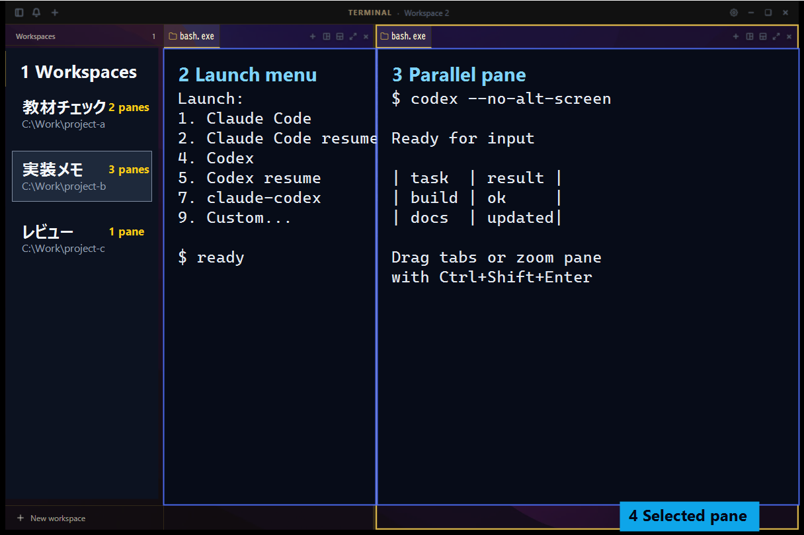

# mycmux-lite

> Source note: this is the `mycmux-lite.exe` source tree. Edit `C:\Users\miyaz\cmux-for-linux-dev-master` when changing the full `C:\Users\miyaz\mycmux-app\mycmux.exe`; use this worktree only for `C:\Users\miyaz\mycmux-lite-app\mycmux-lite.exe`.

`mycmux-lite` は、チーム配布向けの軽量版ターミナルワークスペースです。Claude Code / Codex / claude-codex を、ワークスペース、ペイン、タブ単位で並べて扱えます。

lite 版は、通常版 mycmux からファイルサイドバー、パスジャンプ、Claude Buddy を外し、ターミナル作業に必要な部分へ絞っています。

公開配布先: <https://github.com/miyafcos/mycmux-team>



スクリーンショット内の端末本文と作業名は、公開用のサンプル表示に差し替えています。

## 画面の見方

| 番号 | 場所 | できること |
| --- | --- | --- |
| 1 | Workspaces | 作業テーマごとにワークスペースを切り替える |
| 2 | Launch menu | Claude Code、Codex、resume 起動、任意コマンドを選ぶ |
| 3 | Parallel pane | 複数エージェントやログを横に並べて確認する |
| 4 | Selected pane | 黄色の枠で現在の操作対象を見分ける |

## 何ができるか

- 複数の Claude Code / Codex セッションを、1つの画面に並べて見る
- ワークスペース、ペイン、タブで作業を分ける
- タブをドラッグして、別ペインや別ワークスペースへ移動する
- `Ctrl+Shift+Enter` で今見たいペインだけを拡大する
- Codex の Markdown 表を崩れにくく表示し、ログや回答を読みやすくする
- フォント、テーマ、背景画像を切り替えて、作業画面を見やすくする
- セッション復元で、前回の作業場所と表示内容から再開する

## 通常版との違い

lite では、チーム配布前に不安定だった機能を外しています。

| 項目 | mycmux-lite |
| --- | --- |
| ワークスペース / ペイン / タブ | あり |
| Claude Code / Codex / claude-codex 起動 | あり |
| セッション復元 | あり |
| テーマ / フォント / 背景設定 | あり |
| ファイルサイドバー | なし |
| パスジャンプ | なし |
| Claude Buddy | なし |

普段のターミナル作業、複数エージェントの並列利用、チーム配布の安定性を優先する場合は lite 版を使います。

## 使い方の流れ

1. `Ctrl+Shift+N` でワークスペースを作ります。案件、調査、実装などの単位で分けます。
2. 新しいペインやタブを開くと Launch メニューが出ます。Claude Code、Codex、resume 起動、任意コマンドを選べます。
3. `Ctrl+Alt+D` で右分割、`Ctrl+Alt+Shift+D` で下分割。複数のエージェントを同時に見られます。
4. タブをドラッグすると、別ペインへの移動、ペイン端への分割、別ワークスペースへの移動ができます。
5. 1つのペインに集中したいときは `Ctrl+Shift+Enter` で拡大します。背景は通常表示と連続して見えます。
6. Settings から Themes を開くと、フォント、色、背景プリセット、背景画像を調整できます。

## Launch メニュー

| 番号 | 起動候補 | 用途 |
| --- | --- | --- |
| 1 | Claude Code | Claude Code を新規起動 |
| 2 | Claude Code (resume) | Claude Code の既存セッションを再開 |
| 3 | Claude Code (dangerous) | `claude --dangerously-skip-permissions` で起動 |
| 4 | Codex | Codex を新規起動 |
| 5 | Codex (resume) | Codex の既存セッションを再開 |
| 6 | Codex (dangerous) | `codex --dangerously-bypass-approvals-and-sandbox` で起動 |
| 7 | claude-codex | claude-codex を新規起動 |
| 8 | claude-codex (resume) | claude-codex の既存セッションを再開 |
| 9 | Custom... | 任意コマンドを入力 |

dangerous は承認やサンドボックスを弱める起動方法です。通常作業では 1 / 2 / 4 / 5 / 7 / 8 を使ってください。

Codex は `--no-alt-screen` 付きで起動します。ターミナルのスクロール履歴を残し、入力欄表示のちらつきや復元時の表示崩れを抑えるためです。

## インストール

### Windows

Releases から `mycmux-lite_*_x64-setup.exe` をダウンロードして実行します。

```powershell
gh release download --repo miyafcos/mycmux-team --pattern "mycmux-lite_*_x64-setup.exe"
```

SmartScreen が出る場合は「詳細情報」から実行してください。現在の配布物は Authenticode 署名なしです。

ソースから起動する場合:

```powershell
git clone https://github.com/miyafcos/mycmux-team.git
cd mycmux-team
npm install
npm run tauri dev
```

### macOS (ソースビルド)

macOS 向けの公式 release バイナリは現状ありません。ソースから `.app` を作って `/Applications` に置く運用です。Apple Silicon (arm64) を想定。

前提:
- Xcode Command Line Tools (`xcode-select --install`)
- Rust (rustup) と Node.js / npm

```bash
git clone https://github.com/miyafcos/mycmux-team.git ~/dev/mycmux-team
cd ~/dev/mycmux-team
npm install
npm run tauri build
mv "/Applications/mycmux-lite.app" ~/.Trash/ 2>/dev/null   # 既存があれば
cp -R src-tauri/target/release/bundle/macos/mycmux-lite.app /Applications/
xattr -cr /Applications/mycmux-lite.app                    # Gatekeeper の quarantine 属性を除去
open /Applications/mycmux-lite.app
```

Resume palette (`Cmd+P`) を使うには `crsm` を別途 build しておく必要があります。

```bash
git clone https://github.com/miyafcos/crsm.git ~/crsm
cd ~/crsm
cargo build --release
# 以後、mycmux-lite は ~/crsm/target/release/crsm を自動検出します
```

## 主なショートカット

ショートカットは `Ctrl+,` から変更できます。

> **macOS**: 表記は `Ctrl+…` ですが、macOS では `Cmd+…` も等価扱いされます。Mac ネイティブ慣習どおり `Cmd+P` で Resume、`Cmd+Shift+N` で新規ワークスペースが開きます。

| 操作 | ショートカット |
| --- | --- |
| サイドバー表示/非表示 | `Ctrl+B` |
| ショートカット設定 | `Ctrl+,` |
| 新規ワークスペース | `Ctrl+Shift+N` |
| 次のワークスペース | `Ctrl+Tab` |
| 前のワークスペース | `Ctrl+Shift+Tab` |
| ワークスペース 1-8 へ移動 | `Ctrl+1` - `Ctrl+8` |
| 最後のワークスペースへ移動 | `Ctrl+9` |
| ワークスペースを閉じる | `Ctrl+Shift+W` |
| 右にペイン分割 | `Ctrl+Alt+D` |
| 下にペイン分割 | `Ctrl+Alt+Shift+D` |
| アクティブペインを閉じる | `Ctrl+Alt+W` |
| 左/右/上/下のペインへフォーカス | `Ctrl+Alt+Arrow` |
| ペインを拡大/戻す | `Ctrl+Shift+Enter` |
| フォーカス中ペインを点滅表示 | `Ctrl+Shift+H` |
| ターミナル内検索 | `Ctrl+Shift+F` |
| CRSM Palette (過去セッション一覧) | `Ctrl+P` |

## セッション復元

アプリ終了後に再起動すると、ワークスペース、ペイン、タブ、作業ディレクトリ、直前のターミナル表示を復元します。

Claude Code / Codex / claude-codex の前回セッションは、直前の会話表示と作業場所がペインに残ります。再開したい場合は `Ctrl+P` で CRSM Palette を開き、対象のセッションを選んで手動で resume 起動してください。

> v0.4.0 以降、保存済みセッション ID を使った自動 resume 起動は廃止しました。新規ペインに `MYCMUX_RESUME` などの環境変数が伝播してエージェントモードが意図せず暴発する事故 (env 汚染) を防ぐためです。CRSM Palette の手動選択がデフォルトの再開フローになります。

## 開発

### Windows

```powershell
npm install
cmd /c npx tsc --noEmit
cargo check --manifest-path src-tauri/Cargo.toml
cargo test --manifest-path src-tauri/Cargo.toml --lib
cargo clippy --manifest-path src-tauri/Cargo.toml --release -- -D warnings
cmd /c npm run tauri build
```

### macOS

```bash
npm install
npx tsc --noEmit
cargo check --manifest-path src-tauri/Cargo.toml
cargo test --manifest-path src-tauri/Cargo.toml --lib
cargo clippy --manifest-path src-tauri/Cargo.toml --release -- -D warnings
npm run tauri build
# 起動の体感を計りたいときは:
bash scripts/measure-mac.sh baseline   # /tmp/mycmux-measure-*.json に出力
```

ビルド成果物は `src-tauri/target/release/bundle/macos/mycmux-lite.app`。`/Applications` に配置するときは `xattr -cr` を忘れずに。

## ライセンス

GPL-3.0。詳しくは [LICENSE](LICENSE) を参照してください。
